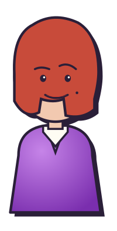

<p align="center">
  
</p>

<h1 align="center">Donna</h1>

<p align="center">
  <strong>A chat workspace where AI agents are real colleagues.</strong><br>
  Part Slack, part Claude Cowork. Built for any business.
</p>

<p align="center">
  <a href="https://github.com/cube-digital/donna/stargazers"></a>
  <a href="LICENSE"></a>
  <a href="https://github.com/cube-digital/donna/issues"></a>
  
</p>

---

Donna lives where your team already talks, channels, threads, direct messages, and adds AI agents that know your business because they read from your actual work: meetings, mail, documents, tickets, chats. Multi-tenant, self-hostable, open source.

> **Pre-1.0.** Foundations are shipped (multi-tenant chat, connector framework, Fathom + Gmail ingestion). The smart context layer ("Cortex") and the retrieval agent are next. We are building in the open.

## What Donna is

| Shape | Like | Why |
|---|---|---|
| Chat workspace | Slack, Discord | The surface your team already knows: public + private channels, DMs, threads, mentions. |
| Collaborative AI workspace | Claude Cowork | Agents read, write, and respond inside the conversation. Draft together, refine in the thread. |
| Context substrate | (the bet under both) | One normalised layer over your tools so agents answer like teammates, not search bars. |

## Who it is for

- **Tech teams** that want their coding agents grounded in real business context (MCP server included).
- **Service businesses** (consultancies, agencies, ops, sales, marketing) that want AI colleagues who know the company.
- **Solopreneurs** building a company where most of the "team" is well-designed agents handing work to each other.

## What is built today

- Multi-tenant chat workspace, channels, threads, DMs, membership.
- Connector framework (provider / client / adapter / webhook / OAuth).
- Bronze ingestion layer (raw artifacts, idempotent).
- Fathom (meetings) and Gmail (mail) connectors, end-to-end.
- Cortex (Silver) layer, structured queryable entities with edges, scoped clustering, anti-hallucination linter. **In progress.**

See the full [roadmap](https://cube-digital.github.io/donna/roadmap.html) for what is next: retrieval agent, Drive, draft/generation agent, WhatsApp, Linear + GitHub, private DMs with agents, learning personalities.

## Repository layout

| Path | What it is | Stack |
|---|---|---|
| `server/` | Backend, multi-tenant chat + agent runtime + ingestion + OAuth + admin | Django 5.2+, DRF, Celery, Postgres 16 + pgvector, Redis 7, uv-managed Python 3.13+ |
| `web/` | Web chat UI | Vite + TypeScript |
| `desktop/` | Desktop chat client | Electron + TypeScript |
| `docs/` | Public website (GitHub Pages) | Static HTML |
| `assets/` | Brand assets, diagrams, figures | PNG, SVG |
| `server/plans/` | Authoritative architecture + build plan | Markdown |

## Quick start (local stack)

```bash
git clone https://github.com/cube-digital/donna.git
cd donna/server

# Full stack: Postgres + Redis + web + worker + beat
docker compose up --build

# Seed OAuth provider rows from env
docker compose run --rm web bootstrap

# Django shell
docker compose run --rm web shell

# Tail Celery worker
docker compose logs -f worker
```

Web UI: `cd web && pnpm install && pnpm dev` (http://localhost:5173).

Full setup, environment variables, and troubleshooting in [`server/plans/06-deployment-and-self-hosting.md`](server/plans/06-deployment-and-self-hosting.md).

## Self-hosting

Donna runs the same code on Cloud and on-premise. Bring your own:

- **OAuth keys** (via env vars or Django admin)
- **Storage** (filesystem / S3 / GCS / Azure, S3-compatible services like MinIO and R2 work)
- **LLM** (LiteLLM-fronted, any OpenAI-compatible endpoint)

One Postgres, one Redis, one Django app, one Celery worker. That is the stack.

## Documentation

| Where | What |
|---|---|
| [Website](https://cube-digital.github.io/donna/) | Vision, motivation, roadmap, changelog |
| [`server/plans/`](server/plans/) | Architecture, data model, conventions, deployment |
| [`server/plans/cortex/`](server/plans/cortex/) | The Cortex substrate, vision, contracts, examples, status |
| [`CLAUDE.md`](CLAUDE.md) | Repo-level guide for AI coding agents |

## Contributing

Donna is built in the open and we welcome contributions, big or small. Start with [`CONTRIBUTING.md`](CONTRIBUTING.md) for setup, conventions, and how to propose changes.

Quick links:

- Bug? Open an [issue](https://github.com/cube-digital/donna/issues/new?template=bug_report.yml).
- Idea? Open a [feature request](https://github.com/cube-digital/donna/issues/new?template=feature_request.yml).
- Question? Start a [discussion](https://github.com/cube-digital/donna/discussions).
- Security finding? See [`SECURITY.md`](SECURITY.md), please do not open a public issue.

## Community standards

- [`CODE_OF_CONDUCT.md`](CODE_OF_CONDUCT.md), Contributor Covenant v2.1.
- [`SUPPORT.md`](SUPPORT.md), where to get help.
- [`CHANGELOG.md`](CHANGELOG.md), release notes (Keep a Changelog format).

## License

[MIT](LICENSE) © Cube Digital.

You can run Donna for any purpose, including commercially, modify it, fork it, and self-host it. The only thing we ask is that the copyright notice stays with the code.
