# End-to-End Example — Building the Silver Layer, Then Retrieving From It

One concrete week, step by step. **Part 1** follows a single Fathom
meeting through every write-path step — what happens, a small diagram,
and why. **Part 2** follows one question through the retrieval agent —
how it calls the API and how silver produces accurate, cited context.

Status markers throughout: ✅ built today · 🟡 partially built ·
📐 designed, unbuilt (P9 / pending amendment).

Companions: [`00a`](./00a%20-%20how-it-comes-together.md) (plain-English
narrative), [`00b`](./00b%20-%20design-debate-qa.md) (debate + pushback
table), [`00c`](./00c%20-%20field-comparison.md) (field comparison),
[`00d`](./00d%20-%20connective-tissue-walkthrough.md) (plane-2
mechanics), [`conversations.md`](./conversations.md) (raw transcript).

---

## The cast

- Workspace **`qube-digital`** (your agency).
- **Acme** is a client; **Alice** (`alice@acme.com`) works there.
- Connected tools: **Fathom** (meetings), **Gmail**, **Drive**.
- Monday: meeting *"Acme onboarding kickoff"*. Tuesday: email *"Re:
  onboarding — Stripe"*. Wednesday: a scanned contract PDF in Drive.

---

# Part 1 — The Write Path

Eleven pipeline steps (`CortexWriter.write`), preceded by the
connector (step 0) and followed by projections (step 12) and the
nightly cycle. The Monday meeting is the running example; Tuesday and
Wednesday call out only what differs.

---

## Step 0 — Webhook → bronze ✅ (sidecar 📐 adopted, pending)

**What happens:** Fathom fires a webhook. The connector task fetches
the transcript + summary, saves the exact JSON to bronze
(`default_storage`) under a provider-keyed path, and creates a
`DeliveryPackage` row pointing at it. Per the storage-debate
resolution (00b), OCR/extraction will also run *here*, once, writing a
derived `.extracted.md` sidecar next to the raw blob.

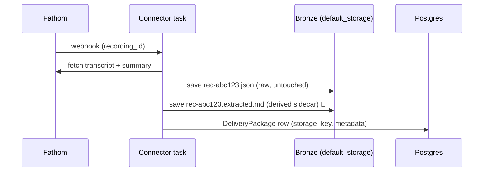

```
bronze/
└── <ws>/fathom/meetings/
    ├── rec-abc123.json           ← raw, the evidence locker
    └── rec-abc123.extracted.md   ← derived, regenerable 📐
```

**Why:** the raw JSON is the court of record — everything downstream
is re-derivable from it. The sidecar is *labeled derived*, never the
record itself: a better OCR engine next year regenerates it without
touching evidence. Bronze keys are computable at webhook time from
`(workspace, provider, item_id)` — that's what keeps retries
idempotent and pointers stable (this is also why bronze is **not**
organized by the wiki hierarchy — see 00b storage-debate resolution).

---

## Step 1 — OCR / markdownify ✅

**What happens:** the pipeline turns the bronze blob into markdown
text. For JSON sources, the provider's adapter renders it
(`adapter.to_markdown()` — deterministic, word-for-word). For binary
(the Wednesday PDF), the OCR facade extracts text — cheap strategy
first, smarter fallbacks only if needed. Once step 0's sidecar lands,
this step just reads it.

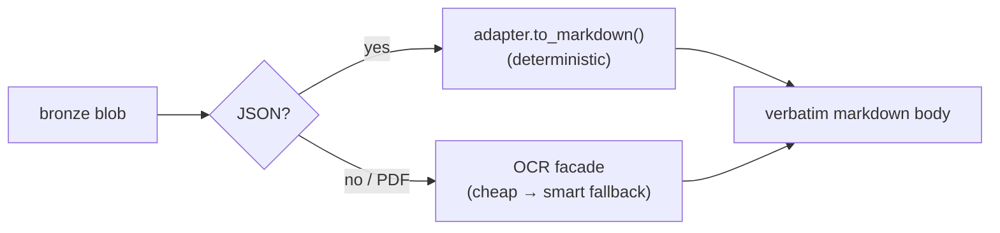

**Why:** this is a *format change* (like docx → pdf), never a rewrite.
No LLM touches the body — that's the anti-hallucination guarantee.
The words an agent will later quote are the words Alice said.

---

## Step 2 — Type resolve ✅

**What happens:** the connector's vocabulary is normalized to one of
the 12 canonical Silver types via `PROVIDER_TYPE_MAP`, and the
matching `TypeSpec` is loaded (template, required fields, embedding
sampler, folder resolver).

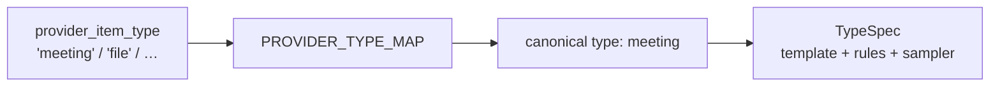

**Why:** closed vocabulary — 12 types, no inventing new ones. Every
ad-hoc type would be a new layout agents must learn and a query that
breaks. The TypeSpec is the single place where a type's shape lives.

---

## Step 3 — Deterministic frontmatter ✅

**What happens:** the cover sheet is filled from **provider metadata
only** — attendees, duration, recording URL for a meeting; thread_id
and participants for an email. Pure copying, conf 1.0.

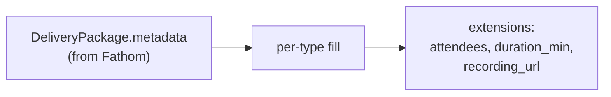

**Why:** facts the provider already asserted need no model and carry
full trust. An agent reads this cover sheet in ~50 tokens instead of
30k tokens of transcript.

---

## Step 4 — Haiku fit (only if missing) ✅ (Monday: skipped)

**What happens:** *only* when required nav fields are still empty, a
small LLM is asked one tightly-controlled question, Pydantic-locked to
a closed menu. Monday's meeting: metadata filled everything → step
skipped entirely. Wednesday's PDF: nothing announces what kind of
document it is → Haiku picks `doc_type` from the fixed list of 16 →
`contract`.

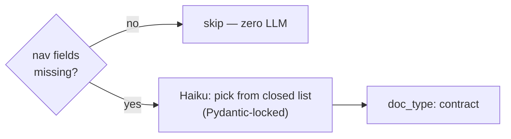

**Why:** the LLM never writes content — it fills one menu field it
cannot invent values for. Gaps get filled; trust tiers stay intact.

---

## Step 5 — Embed + cluster assign 🟡

**What happens:** the body is *sampled* per-type (meetings keep late
sections — decisions happen near the end; contracts keep endings —
signatures), embedded with BGE-small, and assigned to the **nearest
existing topic centroid** by cosine — a dot product, no model run.
The real clustering is nightly (HDBSCAN).

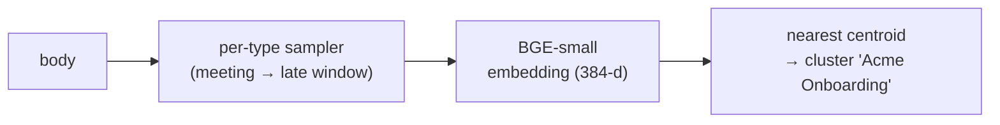

**Why:** topics emerge from content — nobody hand-maintains a folder
taxonomy. 🟡 Caveats: cold start (no centroids until ~5 docs in
scope), and until P9 everything clusters in one workspace-root pot
(pushback #1).

---

## Step 6 — Folder placement ✅

**What happens:** the folder resolver computes the **one canonical
home** from scope + type + date (Universal Folder Structure §9), and a
slug is built from date + title + a short content hash.

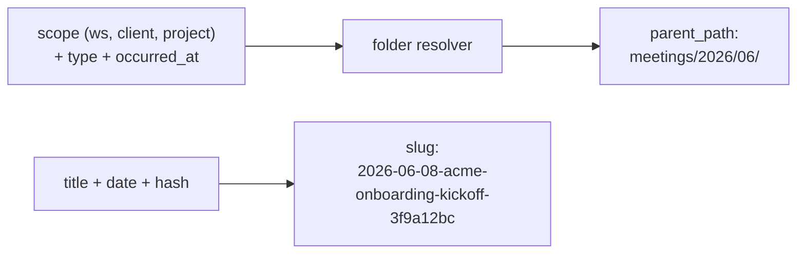

**Why:** **scope, not mention** keys the tree. The meeting lives in
`meetings/2026/06/` because of who *owns* it — it does not get copied
into an "Acme folder" for being *about* Acme. One home per file, zero
drift. ("Everything about Acme" is a query — Part 2.)

---

## Step 7 — Render body ✅

**What happens:** the Jinja template for `meeting` staples the three
mandatory layers together: frontmatter (cover sheet) + verbatim body +
provenance footer.

```markdown
---
type: meeting
title: Acme onboarding kickoff
occurred_at: 2026-06-08 14:00
attendees:
  - "Alice <alice@acme.com> (host)"
  - "You <you@qube.digital>"
duration_min: 45
cluster_name: Acme Onboarding
---

# Acme onboarding kickoff

[ ...the full transcript, word for word... ]

Source: fathom://meeting/rec-abc123 (<ws>/fathom/meetings/rec-abc123.json)
```

**Why:** structure from the template, cleanliness from deterministic
parsing, words from the source. The `Source:` footer makes every page
provable — dispute anything, walk back to the raw JSON.

---

## Step 8 — Build row + dedup ✅ (two-tier 📐 per Living Source Policy)

**What happens:** the rendered bytes are hashed
(`content_hash = sha256(body)`) and an unsaved `CortexEntity` row is
assembled. Dedup today is the `(workspace, content_hash)` unique
constraint; the agreed amendment (00b #9) adds the `(workspace,
source)` lookup first, so a re-ingested Gmail thread becomes a
*version* (`supersedes=[old head]`), not a duplicate.

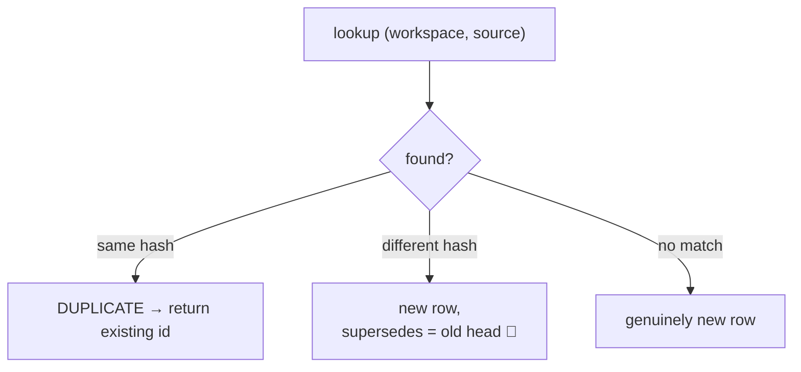

**Why:** idempotency (replaying a webhook costs nothing) without
version pollution. A Fathom meeting never changes at its source, so
its chain never grows past length 1 — one uniform rule, no special
cases.

---

## Step 9 — Entity extraction + resolution ✅

**What happens:** the extractor reads the **envelope, not the
letter** — `alice@acme.com` from attendees → a `person` candidate;
the `acme.com` domain → an `org` candidate (the public-domain guard
stops `@gmail.com` spawning an org called "Gmail"). The resolver
checks: does this thing already have a page? Email/domain exact match
→ reuse the UUID; no match → **spawn a stub** (`author=donna`,
`confidence=medium`, `source=cortex://spawn/…`). Monday: both are new
→ Alice and Acme pages are born. Resolved UUIDs land in
`entity_refs[]`.

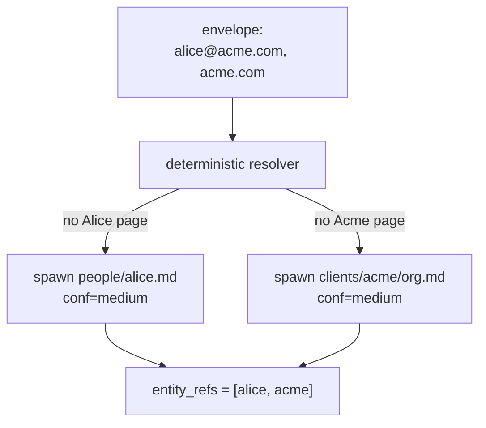

**Why:** email match cannot false-merge (the failure that silently
corrupts LLM-extracted graphs) — it can only under-link, which a merge
flow fixes later (pushback #5). The stub UUIDs are the compounding
asset: *every* future artifact resolves to the same Alice. ⚠️ Known
gaps: `_spawn` bypasses the linter (#3); Alice and Acme aren't linked
to *each other* (`employer_org_id` unset, #11).

---

## Step 10 — Linter gate ✅

**What happens:** the assembled page is checked against the closed
rulebook — valid type, required extensions present, Source footer
present, `occurred_at` set, no ad-hoc edge fields, scope coherent.
Any failure → rejected with one of the closed reject codes; nothing is
written.

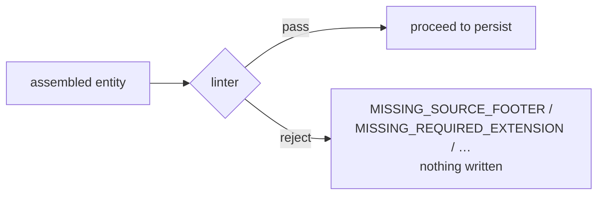

**Why:** rejection at the gate is cheap; cleaning a polluted wiki is
not. The gate sits *after* assembly and *before* persistence, so a
reject costs nothing. This is what makes page #10,000 as trustworthy
as page #1.

---

## Step 11 — Atomic persist ✅

**What happens:** one Postgres transaction: INSERT the row → write the
body file to SilverStorage via the FileField → apply every reverse
edge onto target rows (`sources↔applied_in`,
`supersedes↔superseded_by`, `contradicts↔contradicts`, with
`select_for_update`).

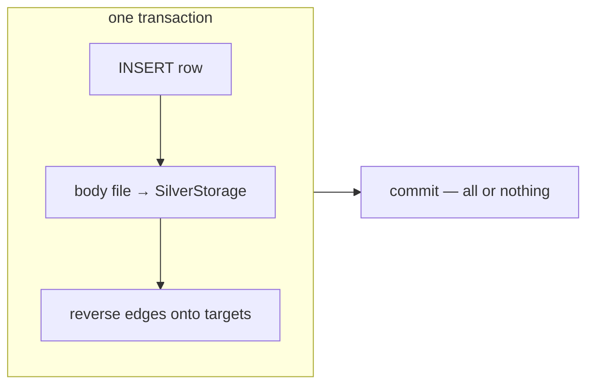

**Why:** if an ADR cites a meeting but the meeting never learns it was
cited, the graph is silently one-directional and "what came out of
this meeting?" becomes unanswerable. Atomicity is the whole point.

---

## The week compounds — Tuesday and Wednesday

**Tuesday (email):** same 11 steps. The one difference is the payoff:
step 9 finds Alice and Acme **already exist** — the email points at
the same UUIDs. Two different tools, one identity.
**Wednesday (PDF):** step 1 runs OCR, step 4 actually fires (Haiku →
`doc_type: contract`). Everything else identical.

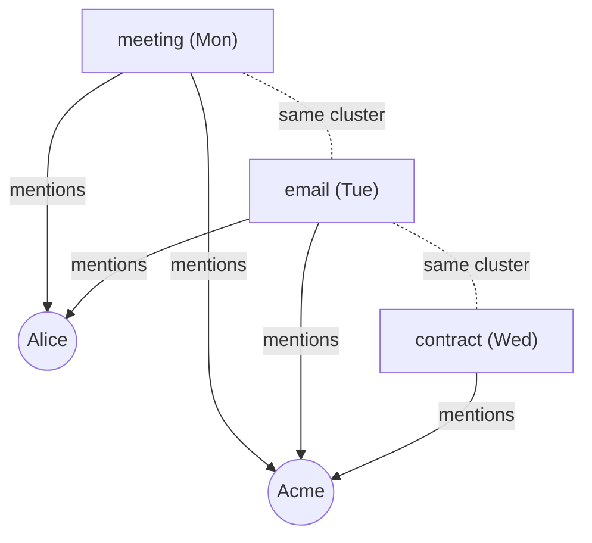

**Filesystem after three days:**

```
qube-digital/                       (SilverStorage — canonical files)
├── meetings/2026/06/
│   └── 2026-06-08-acme-onboarding-kickoff-3f9a12bc.md
├── emails/2026/06/
│   └── 2026-06-09-re-onboarding-stripe-7be20d11.md
├── docs/
│   └── 2026-06-10-acme-services-contract-91c4e02a.md
├── people/
│   └── alice.md                    (spawned stub, conf=medium)
└── clients/acme/
    └── org.md                      (spawned stub, conf=medium)
```

Five pages, seven threads, zero copies. **No folder contains "all the
Acme documents"** — and that's deliberate.

---

## Step 12 — Projections: `_index.md` + `_log.md` 📐 (P9)

**What happens (designed):** a vault-renderer job regenerates each
touched folder's `_index.md` (a *briefing-shaped* catalog — docs
grouped by `doc_type`, tickets by `status`, meetings by recency, heads
only) and appends one line per event to `_log.md`.

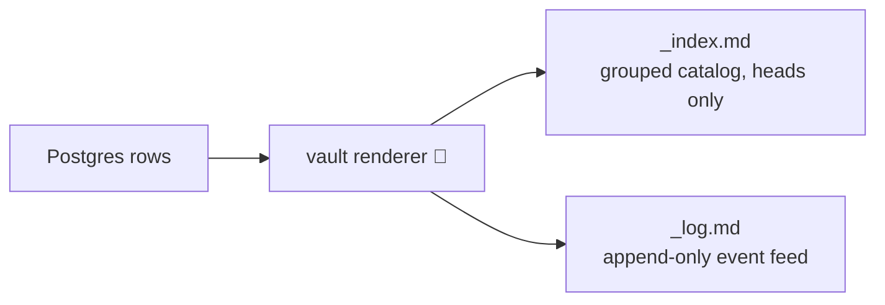

**Why:** pure plane-3 projections — delete them, regenerate, get the
identical file. They serve browse mode and humans in Obsidian; they
are never sources of truth. Open decisions before building: debounced
regeneration, heads-only listing, shipping `_log.md` early (00b #10).

---

## Nightly — the janitor 🟡 (recluster runs; the rest designed)

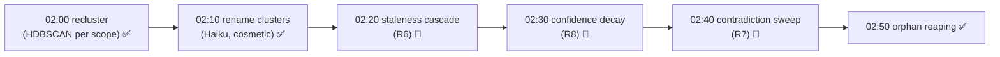

**Why:** maintenance touches only planes 2 and 3 — clusters,
confidence, derived docs. **Ground-truth bodies are never mutated.**
That's what lets you trust a wiki that rewrites itself every night.

---

# Part 2 — The Read Path: the Retrieval Agent

📐 **This whole part is the P9 surface** — designed, and the agreed
next build (every thread converges on "P9 first"). The agent consumes
Cortex through the 8-method MCP API; write methods
(`cortex.create_entity`, `cortex.linter_check`) are pinned by spec,
read-method names below are illustrative.

The question: **"What's the status of Acme onboarding?"**

---

## Step R1 — Resolve the entity

**What happens:** "Acme" → the Acme page's UUID, via alias lookup on
curated entities (exact/alias match — same deterministic resolver
rules as the write path).

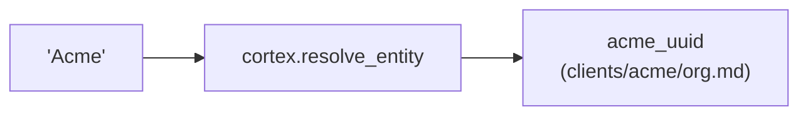

**Why:** every downstream query keys on the UUID, not the string —
"Acme", "ACME Corp" and `acme.com` all resolve to one anchor. This is
the payoff of step 9's UUID accretion.

---

## Step R2 — Gather: multi-channel search

**What happens:** one API call fans out into parallel channels and
fuses the results.

| Channel | Mechanism | Status |
|---|---|---|
| Graph | `entity_refs @> [acme_uuid]` — GIN containment, ms | ✅ exists |
| Vector | ANN on the question embedding (pgvector) | ✅ exists |
| Keyword | Postgres `tsvector` BM25-style + RRF fusion | 📐 planned (00c #2) |
| Temporal | query date-range → `occurred_at` filter | 📐 planned (00c #6) |

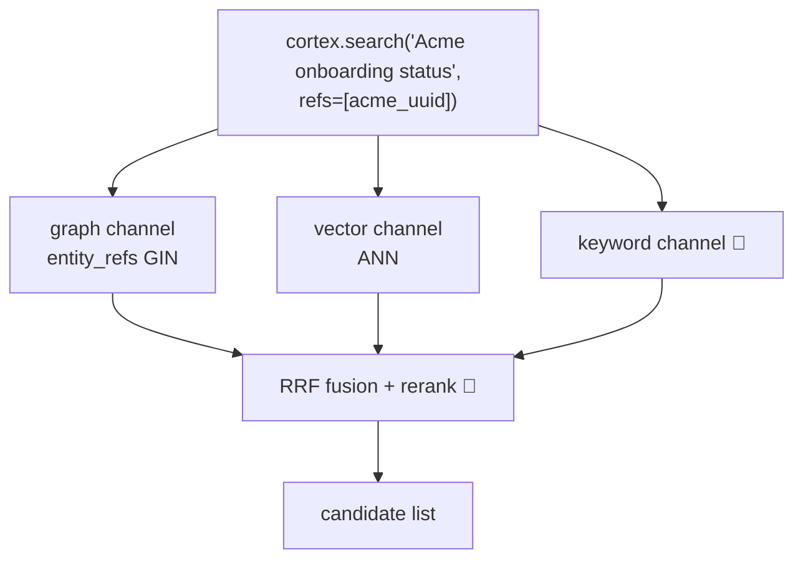

**Why:** single-channel retrieval is the field's documented
anti-pattern (~40% failure for vector-only). The graph channel
guarantees nothing *about Acme* is missed; the vector channel catches
topically-related content the refs don't reach.

---

## Step R3 — Filter: heads only, in scope

**What happens:** every channel applies the default filters —
`superseded_by IS NULL` (Living Source Policy: only current versions
answer questions) and the workspace/scope boundary.

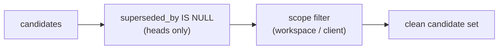

**Why:** without heads-only, a 10-version email thread fills the
top-5 with five copies of itself — retrieval pollution was the *real*
cost of duplication. Ancestors stay readable by id for "diff the
initial proposal vs the final offer" questions.

---

## Step R4 — Rank: the trust ladder

**What happens:** candidates are ordered by `TYPE_AUTHORITY` (the
closed numeric registry), then recency and confidence.

```
decision 100 > doc:contract 95 > doc:offer 80 > doc:spec 70
> meeting 55 > email 50 > ticket 45 > chat 30 > clip 20
```

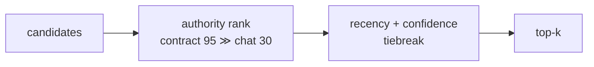

**Why:** when sources disagree, the signed contract outranks the chat
message *by rule*, not by model mood. The ranking is justified because
plane 1 is verbatim — the contract page IS the contract.

---

## Step R5 — Read: frontmatter first, bodies for winners only

**What happens:** the agent reads cover sheets (~50 tokens each) for
the top candidates, then fetches **full bodies only for the final
handful** (`cortex.get_entity` — lazy body via the FileField).

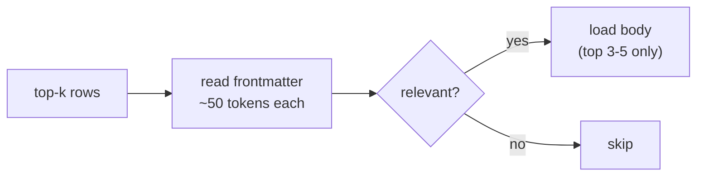

**Why:** agent context is the expensive resource, not storage. The
cover-sheet-first design from step 7 is exactly what makes this cheap.

---

## Step R6 — Synthesize: answer with receipts

**What happens:** the agent composes the answer; every claim cites an
entity UUID, every entity's Source footer points to bronze.

> *"Contract signed Jun 10 [contract]. Payments provider contested:
> Stripe agreed in kickoff [meeting Jun 8], reversed to Adyen
> [email Jun 15] — unresolved, flagged in Open Questions."*

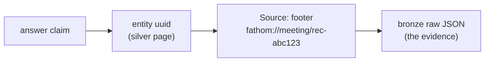

**Why:** the agent never answers from memory — it answers from pages
it can show you. The answer is only ever as wrong as the source
documents themselves; anything disputable walks back to raw bytes.

---

## Browse mode — when the question is vague

**What happens:** for *"what's going on with Acme lately?"* there's no
sharp query. The agent walks the projections instead: open
`clients/acme/_index.md` (grouped catalog: scoped children as real
entries, mentioned-but-foreign content as wikilinks into other
folders), scan `_log.md` ("what changed this week"), descend only into
what looks relevant.

```mermaid
flowchart TD
    A["vague question"] --> B["clients/acme/_index.md 📐<br/>briefing-shaped catalog"]
    B --> C["_log.md 📐<br/>this week's events"]
    C --> D[open 2-3 promising pages]
    D --> E["switch to answer mode<br/>for follow-ups"]
```

**Why:** when the agent doesn't know what to ask, a curated table of
contents beats 20 blind searches. **Search answers questions; the
tree builds orientation.**

---

## The whole read path in one diagram

```mermaid
sequenceDiagram
    participant U as User
    participant A as Donna agent
    participant API as Cortex MCP API 📐
    participant PG as Postgres (derived index)
    participant S as SilverStorage (files)
    U->>A: "Status of Acme onboarding?"
    A->>API: resolve_entity("Acme")
    API-->>A: acme_uuid
    A->>API: search(query, refs=[acme_uuid])
    API->>PG: GIN + ANN, heads-only, scope filter
    PG-->>API: candidates → authority rank
    API-->>A: top-k (frontmatter previews)
    A->>API: get_entity(top 3, with body)
    API->>S: load body files
    S-->>A: verbatim pages
    A-->>U: answer + citations → Source footers → bronze
```

---

## Why this produces *accurate* context — the guarantees, mapped

| Guarantee | Comes from |
|---|---|
| Quoted words are the real words | Plane 1 verbatim bodies (steps 1, 7) — no LLM in the body path |
| Nothing about Acme is missed | Deterministic `entity_refs` at write time (step 9), GIN query at read time (R2) |
| No stale versions pollute the answer | Living Source Policy + heads-only default (steps 8, R3) |
| Conflicts surface instead of being papered over | Authority ladder (R4) + R7 contradiction flags — never auto-resolved |
| Every claim is checkable | Citation chain: answer → silver UUID → Source footer → bronze blob (R6) |
| Page #10,000 is as trustworthy as page #1 | Linter gate on every write, any author (step 10) |
