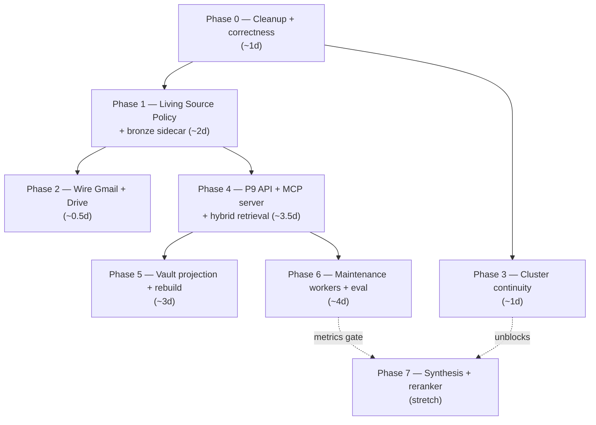

# Silver Layer Completion Plan — End to End

The master plan that takes Cortex from "write-only, partially built" to
a complete silver layer: all three planes alive, agents reading and
writing through the API, maintenance running nightly, quality measured
by an eval harness. Testing is built into every phase, not appended.

Drafted 2026-06-11. Sources merged: the official roadmap
(`server/plans/cortex/06 - status/03-roadmap-remaining-work.md`,
phases P8–P16), the 15 tracked pushbacks
([`00b`](./00b%20-%20design-debate-qa.md)), the field-comparison
improvement list ([`00c`](./00c%20-%20field-comparison.md)), the Narrio
adoptions ADR (`06-narrio-adoptions.md`), and the 2026-06-11 code
audit of `server/donna/cortex/`.

Companions: [`00a`](./00a%20-%20how-it-comes-together.md) (narrative),
[`00d`](./00d%20-%20connective-tissue-walkthrough.md) (plane-2
mechanics), [`00e`](./00e%20-%20end-to-end-example.md) (worked
example), [`00h`](./00h%20-%20ask-donna-roadmap.md) (**the
question-answering milestone cut of this plan** — ~7 days to "ask
Donna"), [`00i`](./00i%20-%20silver-implementation-reference.md)
(**the developer handbook for this plan** — file-by-file change maps
+ target-state code per phase),
[`conversations.md`](./conversations.md) (raw transcript).

---

## 1. What "complete" means — definition of done

| # | Criterion | Verified by |
|---|---|---|
| 1 | All 15 pushbacks closed or explicitly deferred (#5 merge flow, #13 volume knobs stay deferred by decision) | pushback table in 00b updated per phase |
| 2 | Spec and code agree — zero pending amendments | SPEC.md diff review |
| 3 | An agent can resolve → query (3 channels) → read → write through **both transports** — HTTP for the embedded agent, MCP tools for Claude Code / plugin / CLI — linter gating every write | Phase 4 endpoint + MCP parity tests |
| 4 | The vault renders, and Postgres rebuilds from files (spec §14 promise) | Phase 5 round-trip test |
| 5 | Maintenance (recluster, R6, R7, R8) runs nightly without touching plane 1 | Phase 6 beat schedule + tests |
| 6 | Retrieval quality is **measured** — Recall@10 / MRR on a locked question set, run on every retrieval change | Phase 6 eval harness |
| 7 | Re-ingesting a living source produces a version chain, never duplicates; answers read heads only | Phase 1 tests |
| 8 | Bronze is an actual evidence locker — no key ever overwritten | Phase 1 connector tests |

## 2. Current state snapshot

| Subsystem | State | Evidence |
|---|---|---|
| Write pipeline (11 steps) | ✅ built | `pipeline.py`, 11/11 tests green |
| Entity extraction/resolution | ✅ built, 3 known bugs | #3 (linter bypass), #4 (GLiNER), #11 (employer link) |
| Clustering | 🟡 half-alive | no cosine floor (#14), UUID churn (#15), single-scope (#1) |
| Living Source Policy | 📐 agreed, unbuilt | 00b #9 resolution |
| Bronze sidecar + versioned keys | 📐 agreed, unbuilt | 00b #12 + storage-debate resolution |
| Connectors → Cortex | 🟡 Fathom + Gmail wired | P8 reduces to the Drive hop (correction via [`00h`](./00h%20-%20ask-donna-roadmap.md) §6) |
| Read API (P9) | 📐 designed | the converged "first" of every thread |
| MCP server (`cortex.*` tools) | 📐 promised by ADR-007/008, unbuilt | spec §10.1 — Claude Code / plugin / CLI all write through it |
| Vault projections (`_index.md`/`_log.md`) | 📐 designed | #6, #10 |
| Maintenance R6/R7/R8 | 📐 designed | #7 |
| Eval harness | 📐 designed, never executed | 00c gap #3 |
| Hybrid retrieval | 📐 planned | 00c improvements #2/#3 |
| Synthesis (patterns/narratives) | 📐 ADR-0001 locked, PR plan exists | Narrio PR 2/3 |
| Dead code | ❌ ~550 lines | audit: `storage.py`, `SilverEntity`, `ClusteringService`, `DerivedNamespaceView`, resolver classes |
| Repository layer | ✅ removed 2026-06-11 | `repository.py` deleted; atomic reverse-edge writes live on `CortexEntityManager.save_with_reverse_edges` (`models.py`); `find_in_scope`/`find_by_id` dropped (zero callers); `find_referencing` inlined into `DerivedNamespaceView` |
| `__main__` demo harnesses | ✅ added 2026-06-11 | 9 silver files runnable standalone (`python -m donna.cortex.<module>`); Phase 0 deletions must trim the demos that exercise deleted classes |

## 3. Phase dependency graph



Rationale for the order: Phase 0 first because every later phase
touches the same files — clean before building. Phase 1 before the API
so heads-only semantics exist before anything reads. Phase 3 is
independent (can run parallel) but **must** precede Phase 7 — patterns
anchor on cluster UUIDs. Phases 5 and 6 both depend only on 4.

---

## 4. Phase 0 — Cleanup + cheap correctness (~2 days)

**Goal:** delete the speculative ~550 lines, fix the four cheap
pushbacks, and make the two silent correctness gaps loud.

### Deletions (verified dead — nothing imports them)

| Item | File | Lines |
|---|---|---|
| `SilverStorage` Protocol + `LocalFSStorage` | `server/donna/cortex/storage.py` (whole file) | 268 |
| `SilverEntity` Pydantic twin of the Django model | `server/donna/cortex/schemas.py` | ~70 |
| `ClusteringService` (pipeline bypasses it) | `server/donna/cortex/clustering.py` | ~25 |
| `DerivedNamespaceView` (now wraps one inlined query) | `server/donna/cortex/folders.py` | ~20 |

Deleting `storage.py` closes pushback #8 (two storage truths) — the
backend design lives on in SPEC §8 where it belongs.

⚠️ Deletion fallout from the 2026-06-11 session work: the `__main__`
harnesses in `clustering.py` (exercises `ClusteringService`) and
`schemas.py` (builds a `SilverEntity`) lose those demo sections with
their classes; `tests/test_derived_view.py` goes with
`DerivedNamespaceView` (its query moves wherever the entity-axis
lookup lands — likely the Phase 4 `CortexService`).

### Refactors

- ✅ **Done 2026-06-11**: repository → `CortexEntityManager` on
  `models.py` (`CortexEntity.objects.save_with_reverse_edges`);
  `repository.py` + `test_repository.py` deleted, tests ported to
  `test_save_with_reverse_edges.py`.
- `folders.py`: 9 resolver classes → plain functions (the sampler
  idiom from `embeddings.py`); `TypeSpec.folder_resolver` becomes a
  callable. 277 → ~110 lines, behavior identical.
- Remove `NoOpFitter` and the `try/except NotImplementedError` control
  flow in pipeline step 4 → `fitter: TemplateFitter | None = None`,
  guarded by `if self.fitter and type_spec.fit_model:`. (The current
  catch conflates "no fitter configured" with "fitter declined" —
  both swallow silently; a real fitter raising `NotImplementedError`
  for a bug would be invisible.)
- ~~`pipeline._build_extensions` → TypeSpec hook~~ **superseded
  2026-06-11**: the canonical-adapter-models decision (Phase 2) kills
  `_build_extensions` entirely — adapters emit typed canonical
  payloads, nothing maps loose dicts anymore. Don't build the hook.
- `CortexEntityManager` moves to `managers.py` (Django convention) —
  `models.py` keeps models only.
- `CortexWriter` → `CortexPipeline` rename + strip unused ctor knobs.
- Template declarations collapse: 12 boilerplate `templates/<type>.py`
  files + the `apps.ready()` discovery walk → one declarative
  `cortex/types.py` table (12 `TypeSpec` rows). Registry shrinks to a
  module-level dict lookup; `.j2` files stay where they are and load
  through the normal template loader.
- Extractor split: pure extraction (provider-metadata, GLiNER —
  text+meta in, candidates out) → `donna/core/extractors/entities/`
  with a base protocol + composite facade (core-safe: no app-model
  imports). `DeterministicResolver` (DB matching, row spawning) stays
  in cortex. The standalone metadata-extractor idea is dropped —
  canonical adapter models (Phase 2) carry participants/owner as
  typed fields, nothing left to extract.
- `HaikuFitter.fit`: replace the crude `text[:8000]` head-cut with
  the TypeSpec's `embedding_sampler` (head_tail for docs) — contracts
  reveal their nature in the signature block, which a head-cut never
  sees. Sampler infra already exists; one-line change.
- **Classification ladder tier A** (`doc_classifier.py`, new):
  heuristic `doc_type` detection BEFORE the fit step — mime map
  (pptx → presentation, xlsx-derived → other), filename signals
  ("NDA", "contract", "invoice", "SOW"), regex anchors in the body
  ("WHEREAS"/"IN WITNESS WHEREOF" → contract, "Revision History" +
  TOC → spec, "Runbook"/numbered ops steps → runbook). Free,
  deterministic, fires on the obvious 40-60% — every hit is a Haiku
  call that never happens. Ladder tiers B/B+ land in Phases 4/6.

### Correctness fixes

| Pushback | Fix |
|---|---|
| #3 | `DeterministicResolver._spawn` routes through `FrontmatterLinter.check()` + `CortexEntity.objects.save_with_reverse_edges()` — also fixes its non-atomic `row.save()` + `row.body.save()` double-write |
| #4 | `GLiNERExtractor.extract` reads `entity.load_body()` (or takes the body as a parameter from the pipeline) instead of the removed `body_md` attribute |
| #11 | At spawn time, when person + org candidates derive from the same email (`alice@acme.com` → Alice, `acme.com` → Acme): set `extensions.employer_org_id` + a `related` edge. Spawn-time only; never overwrite a human-set employer. Reverse case (org spawns after person) deferred to a nightly backfill |
| #14 | Cosine floor in `HDBSCANClusterer.assign()` — constructor param `min_similarity` (default ~0.55); below floor → `(None, None)` and the nightly pass picks it up |
| — | `CortexEntityManager` `_assign_superseded_by` / `_append_applied_in` / `_append_contradicts`: missing target → structured log + raise in DEBUG (no more silent `return`) |
| — | `_check_known_edges` validates extension keys against `KNOWN_EDGE_FIELDS` instead of the hardcoded typo list `{"sourcs", "ref", "links"}` |
| — | Relax `_check_scope` (INVALID_SCOPE) to allow `(client_id=None, project_id=set)` — workspace-internal projects are real (Donna itself is one) and `folders._scope_prefix` already files them at `projects/<slug>/`; today the linter rejects a case the resolver supports. Spec §6 one-line amendment in the same PR (decision 2026-06-11) |

### Tests

- Update the 5 existing test files for the deletions/refactors.
- New: spawn-through-linter (reject propagates, write is atomic),
  GLiNER smoke test with mocked model, employer link set at dual
  spawn, cosine floor returns `None` below threshold, dangling
  `supersedes` target raises.

**Closes: #3, #4, #8, #11, #14.**

---

## 5. Phase 1 — Living Source Policy + bronze sidecar (~2 days)

**Goal:** versions, not duplicates, for living sources; bronze becomes
a real evidence locker; OCR runs once at ingest.

### Spec amendments first (same PR)

1. Living Source Policy (rules 1–5 from 00b #9) → SPEC §dedup.
2. OCR-at-ingest + `.extracted.md` derived sidecar (storage-debate
   resolution) → SPEC §bronze.
3. Versioned bronze keys (#12) → SPEC §bronze.

### Two-tier dedup — `pipeline.py` step 2½

Build it directly at the early-bail position (right after type
resolve) per the 4c pipeline reorder — a replayed duplicate must skip
GLiNER/embedding/Haiku, not pay them and discard. (The extraction
move 9 → 4½ stays in Phase 4 where suggestion needs it; dedup
placement belongs here with the dedup logic.)

```python
head = CortexEntity.objects.filter(
    workspace_id=dp.workspace_id, source=source_uri,
    superseded_by__isnull=True,
).first()
if head is not None:
    if head.content_hash == content_hash:
        return head                      # DUPLICATE — replay guard
    new_entity.supersedes = [str(head.id)]   # version, not duplicate
# no match → genuinely new
```

### Supersession side effects — `CortexEntityManager._assign_superseded_by`

Ancestor keeps its words, loses its weight: body file untouched (R1),
`doc_embedding = None`, `cluster_id = None`. Plane-2 operation —
allowed by the maintenance rules.

### Heads-only defaults

- Migration: partial indexes `WHERE superseded_by IS NULL` on
  `(workspace, type, occurred_at)` and the `entity_refs` GIN.
- Every read path defaults to heads-only — the entity-axis lookup
  (today `DerivedNamespaceView._find_referencing`, post-Phase-4 the
  `CortexService` query methods); ancestors reachable by id /
  chain-walk. (`find_in_scope` / `find_by_id` were deleted with the
  repository — the service reintroduces scope queries properly.)

### Connector changes (fathom / mail / drive tasks)

- Bronze keys become versioned:
  `{ws}/{provider}/{kind}/{item_id}/{content_sha8}.json` — **never**
  `delete` + `save` on the same key again. `DeliveryPackage.storage_key`
  points at the newest version.
- OCR/extraction at ingest: write `{...}/{content_sha8}.extracted.md`
  beside the raw blob (derived, regenerable, never the court of
  record). `CortexWriter._body_for()` prefers the sidecar, falls back
  to inline OCR.
- Drive: stop double-storing `exported_text` (currently inside the
  `.json` **and** as `.txt`) — keep the sidecar only.
- Delete `donna/cortex/ocr.py` (the `OCRService` shim): with the
  sidecar in place the pipeline reads `.extracted.md` and never calls
  OCR; the inline fallback uses `donna.core.ocr.create_ocr()`
  directly (decision 2026-06-11 #8).
- Adapters drop `to_text()`/`to_markdown()` — bronze never needed
  markdown; rendering is a silver concern. The markdown body comes
  from the `.extracted.md` sidecar (docs) or the canonical model's
  template render (structured types). Full adapter redesign in
  Phase 2.

### Tests

Replay same payload → DUPLICATE (row count unchanged). Grown thread →
chain of 2, correct head, ancestor's embedding nulled and cluster
cleared, body still readable. Heads-only query excludes ancestors;
chain-walk reaches them. Bronze: two ingests of the same source → two
keys, zero overwrites. Sidecar present → OCR facade never invoked
(assert via mock).

**Closes: #9, #12 (+ the Drive within-bronze duplication).**

---

## 6. Phase 2 — Canonical adapter models + wire Drive (~2 days)

**Goal:** all three live connectors feed the silver layer through
**typed canonical models** instead of loose metadata dicts (decision
2026-06-11 #4). (Code-verified 2026-06-11: Gmail is already wired —
this phase is Drive + the adapter redesign.)

### Canonical models (`donna/core/integrations/canonical.py`)

One frozen dataclass/Pydantic model per canonical entity type —
`CanonicalMeeting`, `CanonicalEmail`, `CanonicalDoc`,
`CanonicalTicket`, … `CanonicalOrg`, `CanonicalPerson`,
`CanonicalProject`. The adapter contract changes from
`to_markdown() + metadata() → dict` to **one adapter per (provider,
entity)** emitting one canonical instance:

- Fathom → `MeetingAdapter` (single-entity vendor, one adapter).
- Gmail → `EmailAdapter`.
- Drive → `DocAdapter` (`mime_type`, `owner`, parent-folder name).
- Future CRM → adapter *set*: `CompanyAdapter → CanonicalOrg`,
  `DealAdapter → CanonicalProject(status="proposed")`,
  `ContactAdapter → CanonicalPerson` — multi-entity sync falls out
  of the shape instead of fighting it.

Consequences:

- `pipeline._build_extensions` **deleted** — `extensions =
  canonical.model_dump()`; typed at the adapter, no loose-dict
  mapping, no per-type if-chain.
- `ProviderMetadataExtractor` shrinks to trivial iteration over the
  canonical model's typed participant/owner fields.
- `DeliveryPackage` carries the canonical payload (JSON of the model
  + `canonical_type` discriminator).
- Rich provider metadata lands in `CortexEntity.extensions` (and
  later `CortexChunk`) — feeds the metadata-first query axis.
- Pydantic validates at the adapter boundary → the linter slims to
  the invariants Pydantic can't express (scope, footer, cross-refs,
  dup-hash) — pending the #2 keep-or-slim decision.

### Wire Drive

- `connectors/google/drive/tasks.py`: append the cortex hop (same
  pattern as Fathom/Gmail), emitting `CanonicalDoc`.
- `PROVIDER_TYPE_MAP` already maps `file → doc`, `message_thread → chat`.

### Tests

Adapter unit tests per canonical model (fixture payload → typed
instance, validation rejects malformed); integration: Gmail thread
fixture → `email` entity with participants + thread_id; Drive PDF
fixture → `doc` entity with `doc_type` from mocked HaikuFitter; both
linted and persisted with entity_refs; pipeline never sees a loose
metadata dict (assert `_build_extensions` is gone).

---

## 7. Phase 3 — Cluster identity continuity (#15) (~1 day)

**Goal:** cluster UUIDs survive recluster runs; topics keep their
identity as data grows. **Hard prerequisite for Phase 7** —
`CortexPattern` anchors on cluster UUIDs.

Algorithm in `tasks.py _recluster_scope`:

1. Snapshot old centroids `(cluster_id → centroid, name)` before
   HDBSCAN.
2. Run HDBSCAN → integer labels → compute new centroids per label.
3. Match new → old by cosine similarity (greedy, threshold ~0.80):
   matched → reuse old UUID **and** name (skip the Haiku call);
   unmatched → mint `uuid5(scope_ns, run_id + label)` and name it.
4. Apply remap as today.

### Tests

Pure relabel churn (same docs, shuffled order) preserves every UUID
and name; a genuine topic split keeps the dominant UUID and mints
exactly one new one; `HaikuNamer` called only for new/changed
clusters (mock assertion).

**Closes: #15. (#1 scope promotion closes in Phase 4 — suggestion at
write time + promotion via PATCH, see 4c.)**

---

## 8. Phase 4 — P9: API + MCP server + hybrid retrieval + scope suggestion (~5 days)

**Goal:** the layer becomes readable and writable by agents — the
converged "first" of every design thread. Hybrid retrieval ships
inside the query endpoint from day one (00c #2: `tsvector` is nearly
free on this stack).

One service, two transports. All logic lives in `CortexService`;
the DRF views (4a) and the MCP server (4b) are both thin adapters
over the same 8 methods — zero duplicated behavior, one linter gate.

### 4a — Service + DRF carrier (~2.5d)

Structure per `server/plans/03-conventions-and-api.md`:

```
donna/cortex/
├── services.py                  # CortexService(BaseService) — ALL logic
├── api/v1/
│   ├── views.py serializers.py filters.py
└── urls.py                      # mounted in donna/urls.py
```

### The 8 methods (roadmap P9, spec §10.2)

| Method | Route | Notes |
|---|---|---|
| `cortex.create_entity` | `POST /cortex/v1/entities` | linter-gated; supports supersedes |
| `cortex.update_entity` | `PATCH /cortex/v1/entities/{id}` | R1: extensions only — body immutable |
| `cortex.read_entity` | `GET /cortex/v1/entities/{id}` | `?include_body=true` lazy body |
| `cortex.query` | `POST /cortex/v1/query` | multi-channel, below |
| `cortex.get_context` | `GET /cortex/v1/entities/{id}/context?depth=2` | edges + refs expansion |
| `cortex.linter_check` | `POST /cortex/v1/lint` | dry-run; returns reject codes |
| `cortex.eval_run` | `POST /cortex/v1/eval` | stub until Phase 6 |
| `cortex.health` | `GET /cortex/v1/health` | counts per type/scope |

Plus the browse endpoints: `GET /cortex/v1/index?path=`,
`GET /cortex/v1/log?path=&since=` (served from Postgres now; files in
Phase 5).

### 4b — The MCP server proper (~1d)

The spec's promise (ADR-007/008, §10.1) is an actual Model Context
Protocol server — `cortex.*` as MCP **tools** — not just HTTP routes.
Every Path-1 writer speaks it: Claude Code / Cursor, the Obsidian
plugin, the `donna` CLI, and external agents.

```
donna/cortex/mcp/
├── server.py        # standalone `fastmcp` package (v3) — the
│                    #   maintained successor to mcp.server.fastmcp
└── __main__.py      # python -m donna.cortex.mcp [--read-only]
```

- **8 tools, 1:1 with `CortexService` methods** — each tool is
  ~10 lines: parse args → call service → serialize. Tool descriptions
  carry the contract (closed type vocab, reject codes, R1 rules) so
  agents self-correct before hitting the linter.
- **Two transports, same server object** (the github-mcp-server
  pattern — stdio local, HTTP hosted):
  - `stdio` — local/self-host: Claude Code and the desktop app spawn
    it; workspace binding via `DONNA_WORKSPACE_ID` env var.
  - `streamable-http` — cloud: `stateless_http=True` +
    `json_response=True` (horizontal-scale posture), Origin
    validation + CORS exposing `Mcp-Session-Id`.
- **Auth, phased per the 2025-06-18 MCP spec** (remote server =
  OAuth 2.1 *resource server*):
  - v1: static workspace API token in `Authorization: Bearer` mapped
    to `(user, workspace)`, same resolution as `WorkspaceMiddleware` —
    the PAT mode GitHub's remote server still accepts.
  - v2 (when external MCP clients connect to cloud): RFC 9728
    Protected Resource Metadata at
    `/.well-known/oauth-protected-resource`, 401 +
    `WWW-Authenticate: resource_metadata=...`, RFC 8707 audience
    validation — Donna's auth becomes the authorization server.
- **`--read-only` flag** — exposes only `query` / `read_entity` /
  `get_context` / `health`; the cheap safety mode for untrusted
  agents.
- Calls `CortexService` in-process (Django setup in `__main__`) — it
  is **not** a proxy to the HTTP API, so self-host works without the
  web container running. (First-party servers own their data layer;
  only third-party bridges like GitHub's must wrap a REST API.)

### `query` — metadata-first, then three channels + RRF

**Metadata filters run before any similarity** (decision 2026-06-11
#1): `type`, `doc_type`, `client_id`/`project_id`, `occurred_at`
range, author, confidence — plain SQL WHERE over the
canonical-model-fed `extensions`, narrowing the candidate set every
channel operates on (pgvector supports filtered ANN natively). The
agent filters structurally first, ranks semantically second.

1. Graph: `entity_refs @> [uuid]` (GIN).
2. Vector: pgvector ANN on the question embedding (within the filter).
3. Keyword: new `tsvector` generated column (title + body sample) +
   GIN index → `ts_rank`.
4. Fuse with Reciprocal Rank Fusion (k=60, ~20 lines of SQL), then
   TYPE_AUTHORITY + recency tiebreak. Defaults: heads-only, workspace
   scope.

The second traversal axis — the filesystem itself (`_index.md`,
frontmatter, folder tree) — is the Phase 5 browse mode; DB query and
file browse are projections of the same rows, so both land on the
same canonical pages.

### 4c — Scope suggestion + promotion (~1d, closes #1)

The dynamic half of pushback #1. The settled scope-vs-mention
principle stays intact: **inference proposes, a deliberate act
disposes.** `client_id`/`project_id` are never written by inference —
files never move on a guess.

**Pipeline reorder (prerequisite — decision 2026-06-11):** the stale
`client_id=None  # set below once entity_refs resolved` comment shows
the original intent; extraction just sits too late (step 9, after
clustering at 5 / folders at 6) for it to ever work. New order:

```
PERSIST (sync — Task 1, no model loads; see 4d):
1 OCR/sidecar → 2 type resolve → 2½ dedup (replay bails before paying
anything) → 3 canonical extensions → 4 fit ladder → 4½ entity
extraction + resolution (provider metadata; moved up from 9) →
4¾ scope (T0 sets, T1 suggests) → 5 folders (real slugs) →
6 render (refs → [[wikilinks]]) → 7 lint → 8 save → on_commit ↓

ENRICH (async — Task 2, Celery; see 4d):
9 sampled embedding → 10 cluster assign (scope known) → 11 T2 scope
assist (needs embedding) → 12 optional GLiNER second-pass refs
```

People are messy — "quick sync" titles, ad-hoc threads, clients on
personal Gmail. So suggestion is an **escalation ladder**: each tier
handles what the one above couldn't; confidence drops as you descend.
T0 is the only tier allowed to *write* scope (vendor ground truth,
not inference); every tier below writes `extensions.suggested_scope =
{client_id, project_id?, basis, confidence}` and nothing else.

**T0 — provider-direct (writes scope, files immediately):**

When the vendor hands over the answer it is ground truth, not a
guess: Linear/Jira project ids, Drive parent-folder mapping, Slack
channel→project map. Scope columns set at write → the entity files
straight into `clients/<x>/projects/<y>/` and clusters in the right
bucket from day one. Mapping table (provider key → project row) is
itself human-confirmed once per project, so determinism is preserved.

**T1 — deterministic inference (suggestion only, always runs):**

- *Participant domains*: every email in the metadata (host, attendees,
  from/to/cc, assignees, owner) → domain → strip public domains +
  the workspace's own → match against `org.extensions.email_domains[]`.
  Exactly one external org with `relationship="client"` → client
  suggestion. Vendor/prospect/multiple/zero → silence.
- *Alias match*: title/subject/bracket-prefix/hashtag candidates vs
  `project` rows scoped under the suggested client. One hit →
  project suggestion; else client-only.
- Participant-based only — who is *in* the thread, never who is
  *mentioned* in the body (that axis stays `entity_refs` →
  `_index.md` links, per the scope-vs-mention resolution).

**T2 — cluster assist (same write, free with step 5):**

Cosine of the new embedding against per-scope centroids acts as a
sanity check on T1, never as a source of record:

```
T1 says X, cluster agrees X   → suggest X, confidence boosted
T1 says X, cluster silent     → suggest X, baseline confidence
T1 silent, cluster says X     → no suggestion; flag for review queue
T1 says X, cluster says Y     → suppress entirely (mismatch = noise)
```

**T3 — Haiku contextual read (only when T1+T2 silent or flagged):**

Same trust pattern as `HaikuFitter`: the prompt carries a **closed
candidate list** (existing client + project rows with their aliases),
structured output picks one or abstains — it can never invent a name.
Body text + metadata in, `{client_id?, project_id?, abstain}` out,
`basis: "llm-contextual"`, capped confidence (always below T1).
Skipped when the workspace has no curated client/project rows yet.

**T4 — human (review queue):**

Whatever remains unscoped (or T2-flagged) surfaces in the Phase 5
review queue (`_index.md` "unscoped with suggestion" section) ranked
by confidence; one click confirms, bulk-confirm for batches.

### 4d — Write-path split: persist fast, enrich async (~0.5d, two tasks)

Architecture-review decision 2026-06-12 (debt #2): the 11-step
pipeline runs OCR + embedding + NER + clustering inline — a 5k-meeting
backfill queues serially behind model inference. Split into **two
tasks**:

**Task 1 — `persist` (synchronous, inside the connector task):**
steps 1–4¾ + 6–10 of the reordered pipeline — body, type, dedup,
canonical extensions, fit ladder, provider-metadata extraction +
resolution, scope T0/T1, folders, render, lint, save. Entity lands
complete and queryable with `doc_embedding=NULL, cluster_id=NULL`.
No model load on this path; ingest latency = milliseconds.

**Task 2 — `enrich_entity` (Celery, dispatched via
`transaction.on_commit`):** everything model-bound — per-type sampled
embedding, cluster assign, **T2 scope assist** (needs the embedding —
moves here naturally), optional GLiNER second-pass refs. Idempotent;
skips rows superseded while queued; retries with backoff. Backfill =
bulk enqueue of the same task.

Consequence: `cluster_name` leaves the body template — plane-2 datum
in an immutable plane-1 artifact (R1) was a layering bug; it lives in
`extensions` only, surfaced by `_index.md` and query results.

Tests: persist path never loads a model (mock import assertion);
enrich on a superseded row is a no-op; on_commit ordering (task sees
the committed row); T2 conflict at enrich time suppresses the stored
suggestion; replayed enrich is idempotent.

**Classification ladder tier B (same PR — kNN over pgvector):**

The fit step gains a second free tier between heuristics (Phase 0
tier A) and Haiku: the new doc's sampled embedding vs its
nearest confirmed-`doc_type` neighbors — one pgvector ANN query,
similarity-weighted majority vote, workspace-local. Zero training,
zero artifacts; returns nothing until confirmations exist, then
improves with every T4 click (same flywheel as scope suggestions —
this is why it lands here, where the review queue starts producing
labels). Haiku demotes to "tiers A+B disagreed or abstained."

**New-structure detection (nightly, pairs with Phase 6 recluster):**

The inverse problem — the scope rows themselves don't exist yet.
When the nightly recluster finds a tight cluster (≥N docs, cohesion
above floor) whose members are predominantly unscoped and no
client/project row matches, emit a **structure proposal**: Haiku
names the cluster, the queue shows "looks like an undeclared
project/client — create row + adopt these docs?" Human confirms →
curated row spawns (resolver path, linter-gated) → members get
`suggested_scope` pointing at it. Emergence proposes, determinism
records.

**Promotion (deliberate, via the Phase 4 surface):**

- `cortex.update_entity` PATCH accepts `client_id`/`project_id` —
  this is the R1-compatible promotion path (scope is index metadata,
  not body).
- On promotion the row re-files: folder resolver recomputes
  `parent_path`, silver body moves to its canonical home (bronze key
  untouched — two layers, two organizing keys), embeddings keep,
  cluster assignment re-runs in the new scope.
- `cortex.query`/`read_entity` responses surface pending
  `suggested_scope` so any client (Claude Code, plugin, CLI) can
  render a one-click confirm; bulk confirm ships with the Phase 5
  review queue view (`_index.md` "unscoped with suggestion" section).

**Explicitly out:** auto-promotion above a confidence threshold.
Wrong scope = file in the wrong client folder = the leak the
boundary exists to prevent. Revisit only after Phase 6 eval data
shows suggestion precision ≈ 1.0.

### Tests

DRF tests per endpoint: workspace-header scoping, R1 enforcement on
PATCH, reject codes through `linter_check`, RRF ordering on a seeded
fixture (doc that only keyword-matches + doc that only ref-matches
both surface), heads-only default, `get_context` depth walk.

MCP tests via the SDK's in-memory client: `list_tools` exposes
exactly 8 (4 under `--read-only`), `create_entity` tool rejects with
the same reject code as the HTTP route (transport parity), workspace
binding isolates tenants, a lint failure surfaces as a structured
tool error — not an exception.

Scope-suggestion tests (4c): reorder — replayed duplicate bails at
step 2½ (mock asserts embedder + GLiNER never called); T0 Linear
ticket with a mapped project files directly under
`clients/<x>/projects/<y>/` and clusters in that scope; rendered
body carries `[[wikilinks]]` for refs resolved at 4½; single-org
meeting yields `suggested_scope` with the right client; two-org
meeting yields none; internal-only participants yield none; mention
of a client in the body without participation yields none
(scope-vs-mention guard);
T2 conflict (participants say X, embedding sits in Y's cluster)
suppresses the suggestion; T3 only fires when T1+T2 are silent, picks
strictly from the candidate list (mock asserts the prompt payload),
and abstains cleanly on a garbage body; nightly structure proposal
fires on a seeded tight cluster of unscoped docs and not on a loose
one; PATCH promotion moves `parent_path`, preserves
`bronze_storage_key`, and re-runs cluster assignment in the new
scope; promotion of a row with no suggestion works identically
(suggestion is advisory, not a precondition).

**Closes: #6 (browse axis becomes real), #1 (suggestion at write time
via 4c, promotion via PATCH; bulk-confirm view completes in
Phase 5).**

---

## 9. Phase 5 — P10 vault projection + P11 rebuild (~3 days) ✅ shipped 2026-06-19

**Goal:** the wiki becomes real files (Obsidian + agent browse mode),
and Postgres proves it is derived.

### Vault renderer (`donna/cortex/vault_renderer.py`)

- Entity `.md` per row at `vault/<workspace_id>/<parent_path>/<slug>.md`
  via `VaultRenderer.render_entity()`. Body content = same Jinja-rendered
  markdown that lives on the flat cortex tree, with frontmatter
  **augmented** with `id` + `content_hash` so rebuild can reconstruct
  rows from files alone (`_augment_frontmatter`).
- `_index.md` per folder via `VaultRenderer.render_index()` — heads only
  (`superseded_by IS NULL`), grouped by type, `[[wikilinks]]` to entity
  slugs.
- `_log.md` per scope via `VaultRenderer.append_log()` — append-only;
  scope prefix derived from `parent_path` so siblings within one
  client/project share a timeline.
- **Prompt-sized projection** — `render_index_for_prompt(scope, max_chars=2500)`
  ready; chat agent integration (00j prompt builder) lives in a follow-up
  task.
- Write amplification — `_render_and_flag` in `managers.py` fires on
  `transaction.on_commit`. Per-entity render + log append are synchronous
  (cheap). Per-folder `_index.md` regeneration is debounced through a
  Redis dirty-set (`vault:dirty:<workspace_id>`) drained by the
  `cortex.flush_vault_indexes` Celery beat task (default 5min cadence,
  configurable via `CORTEX_VAULT_FLUSH_SECONDS`).

### Mode flag

**Deviation from original plan (2026-06-19):** dropped the proposed
per-workspace `Workspace.vault_render_mode: off | live | on_demand`
field as YAGNI. Replaced with a single global env-driven setting
`CORTEX_VAULT_ENABLED` (default `True`). One workspace, one rendering
behaviour; per-workspace toggle will be added when an actual second
workspace asks for different behaviour.

### Rebuild (`cortex_sync --render` + `--rebuild`)

- `cortex_sync --render --workspace=<slug>` — eager render of every
  head entity + per-folder `_index.md` regen. Used for backfill +
  one-shot vault regeneration.
- `cortex_sync --rebuild --workspace=<slug>` — walks
  `vault/<ws>/**/*.md` (skipping `_index.md` / `_log.md`), parses
  frontmatter, reconstructs `CortexEntity` rows by id. Recovers
  display-grade state (type, title, occurred_at, source, content_hash,
  slug, parent_path, body). Embeddings + clusters recovered via
  subsequent `--reindex-embeddings` + `--rebuild-clusters`.
- Edge data (sources, applied_in, supersedes, contradicts) **not yet**
  preserved in vault frontmatter — would require Jinja template
  changes. Open deferred item; round-trip still passes the spec §14
  litmus test for display rows.

### Tests (`server/donna/cortex/tests/test_vault_renderer.py`)

12 tests, ~40ms total:
- Frontmatter augment: injects missing keys, preserves existing, handles
  no-frontmatter bodies
- Frontmatter parse: extracts scalars, **survives the Jinja inlining bug**
  (`occurred_at: 2026-05-27 12:21:30+00:00parent_path: ...` on one line)
- Renderer: writes at `parent_path/<slug>.md`, augments frontmatter with
  id + content_hash, skips entities missing `slug`
- `_index.md` lists heads only (superseded excluded)
- `_log.md` preserves append order across multiple writers
- Disabled-flag path: `CORTEX_VAULT_ENABLED=False` no-ops the renderer
- **Round-trip:** seed entity → render → wipe row → `cortex_sync
  --rebuild` → row restored with matching title + content_hash + type

Test isolation (2026-06-19): added auto-swap in `settings.py` —
`STORAGES["default"]` becomes `InMemoryStorage` and
`CORTEX_VAULT_ENABLED` defaults to `False` when `sys.argv` contains
`test`. Tests that exercise the renderer opt in via
`@override_settings(CORTEX_VAULT_ENABLED=True)`. Result: zero
filesystem residue after a test run. Cleanup script
(`server/scripts/cleanup_test_residue.sh`) sweeps any pre-existing
orphan workspace dirs against the live `workspaces` table.

### Real-world validation (cube-digital)

- Rendered 278 head entities into `vault/6bff774a-.../emails/{2026/05,2026/06}/`
  + 2 `_index.md` files (16KB + 41KB)
- Wipe + rebuild: 278 rows recreated from vault, zero errors
  (`cortex_sync --rebuild --workspace=cube-digital`)

**Closes: #10 (all three sub-decisions except per-workspace mode —
explicitly deferred), #6 fully.**

### Follow-ups (not blocking)

- Edge data in frontmatter so rebuild restores `sources` /
  `applied_in` / `supersedes` / `contradicts` (would need
  `tasks/templates/<type>.j2` edits)
- 00j chat agent system-prompt wiring of `render_index_for_prompt()`
  for scope-bound channels
- Fix the Jinja template inlining bug (`occurred_at:` lines run-on
  into the next field — currently survived by the regex extractor,
  but should be fixed at source)

---

## 10. Phase 6 — P12 maintenance workers + P14 eval harness (~4.5 days)

**Goal:** the layer maintains itself nightly, and quality becomes a
number instead of a feeling.

### Maintenance (beat-scheduled; plane 2/3 only — bodies never touched)

| Rule | Job | Behavior |
|---|---|---|
| R6 | `resynth_curated_entities` | new sources since `last_synthesized` → mark stale, queue resynth; supersession triggers cascade (Living Source rule 5) |
| R8 | `decay_confidence` | unconfirmed > 6 months: high → medium → low |
| R7 | `contradiction_sweep` (`contradictions.py`) | Haiku entailment, high-confidence threshold, pairwise within cluster/refs overlap; **skips supersession chains** (rule 4); writes symmetric `contradicts[]` → Open Questions view |
| 4c | `propose_structures` | post-recluster: tight cluster of predominantly-unscoped docs with no matching client/project row → structure proposal in the review queue (design in 4c "New-structure detection"); also re-checks `suggested_scope` for unscoped heads against fresh centroids (drift/backfill) |
| — | `train_doc_classifier` | **classification ladder tier B+**: nightly per workspace, when any `doc_type` class crosses ~50 confirmed labels → TF-IDF(1-2grams) + LogisticRegression (scikit-learn already a dep, trains <1s CPU); calibrated probability gates the fit step — above threshold auto-fills, below falls to Haiku. Eval harness tracks ladder hit-rates per tier (A/B/B+/C) so Haiku's shrinking share becomes a measured number |
| — | `cluster_aware_org_reclassify` (00m §Future) | **org-relationship Tier B+**: nightly, fed cluster-cohort signal instead of per-email regex. Per org, collect: (a) the set of clusters the org appears in + their Haiku names (free, already computed), (b) cluster co-occurrence with the `self` org (joint-work signal), (c) cluster diversity = breadth of topic spread (deep relationship vs transactional), (d) cluster vocabulary aggregate (SoW/invoice/booking language across the WHOLE cluster, not single email), (e) label propagation from manually-corrected neighbors (orgs sharing >40% cluster overlap with a known client → strong client prior). Feed all five to Haiku via the existing `relationship_classifier_llm` — same cost, much higher recall on the outbound-only / ambiguous cases Tier A leaves as unknown. Skips orgs with `relationship_locked=True` (manual override always wins). Eval-gated: ship the prior + measure ladder hit-rate per tier (A/B/B+/manual) before promoting to default |

### Eval harness (`donna/cortex/eval/`)

- `golden_questions.py` — the locked per-workspace question set
  (SPEC §15's 10 questions + ~50 labeled queries fixture).
- `runners.py` — executes questions against `cortex.query`;
  `metrics.py` — Recall@10, MRR, per-channel attribution.
- Wire `cortex.eval_run`; nightly beat run persists a metrics
  artifact; CI job fails on regression beyond threshold.
- **Gate rule: every retrieval change from now on ships with a
  before/after eval run.** (00c's #1 lesson: unmeasured retrieval is
  always overestimated.)

### Tests

Decay boundary cases (5.9 vs 6.1 months), cascade flips stale on new
cluster member, R7 chain-skip (version N vs N−1 never flagged),
R7 threshold (mocked entailment), eval runner produces metrics file on
the seeded workspace with deterministic fixture answers.

**Closes: #7. Executes 00c improvement #1 (the cheapest, biggest
blindspot).**

---

## 11. Phase 7 — Stretch (next milestone)

Explicitly out of the core; sequenced for after the eval gate exists
so every addition is measured.

| Item | Depends on | Notes |
|---|---|---|
| Narrio PR 2 — `CortexPattern` + Haiku extractor | Phase 3 (#15) | cluster-anchored, `sources=[uuids]` mandatory |
| Narrio PR 3 — `CortexNarrative` + Sonnet compiler | PR 2 | per-scope briefing, lazy compile, staleness via R6 |
| **Recall ladder** — staged retrieval upgrades, eval-gated, vanilla-pgvector only (decision 2026-06-12: stay and maximize pgvector — fancier stays app-side; Cloud must run on RDS-class managed Postgres, which carries pgvector incl. `sparsevec`/`halfvec` but NOT VectorChord/ParadeDB) | Phase 6 eval per rung | Rung 1: learned-sparse channel — fastembed BM42 → `sparsevec(30522)` column + HNSW `sparsevec_ip_ops` → 4th CTE in the existing RRF (knows "net-30"≈"payment deadline" without shared tokens; coexists with tsvector). Rung 2: ColBERT late-interaction as **app-side rerank** over RRF top-50 — per-token matrices (~200×128 f16 ≈ 50 KB/entity, computed in `enrich_entity`, bytea/sidecar), MaxSim in numpy (ms for 50 candidates); pgvector has no multivector — do NOT add VectorChord for this. Rung 3: cross-encoder `bge-reranker-v2-m3` top-50 → top-5 (00c #3). Rungs 2/3 share the rerank slot — add one, measure, stack only if eval still gaps. Footnote: `halfvec` cast halves HNSW RAM at scale, ~zero recall loss, one-line migration |
| P13 enforcement surface (pre-commit hook, `donna` CLI, Obsidian plugin) | Phase 4b | all three are thin clients of the MCP server — no new logic |
| GitHub / S3 storage backends (P15) | first self-host client | re-introduce as real, tested code — not the deleted sketch |
| P0.15 long-doc retrieval: `CortexChunk` sidecar + heading tree | first long-doc client | 00c #4, designed 2026-06-11. Chunks are **derived rows, never entities** (no provenance/folder/dedup lifecycle of their own): `(entity_id FK, ordinal, section_path, page_no, text_span offsets, embedding)` — rebuildable from the body file, spec §14 intact. Split on markdown headings (OCR already emits structure), ~1-2k chars/chunk. Retrieval: chunk-ANN → group-by-parent → entity-level RRF (4th query channel). Entity embedding upgrades from 1900-char sample → centroid of chunk vectors (better clustering, same model). Heading TOC tree stored on the entity powers agent section-navigation (`read_entity?section=`) — the PageIndex insight without its LLM tree-build cost, because we own structured markdown; LLM-navigated tree search deferred until eval shows long-doc recall gaps |
| Entity merge/redirect flow (#5) | needs spec design session | the field's named hardest problem — design before code |
| Per-workspace display aliases for canonical types (law firm sees "Matters", consultancy "Engagements") | Phase 5 vault renderer | presentation-layer label over the locked `project` type — zero schema impact (2026-06-11 naming discussion) |
| CRM connector (HubSpot/Salesforce) — seeds `org`/`person`/`project` registry, ground-truth feed for T1 scope inference | Phase 4 (4c ladder) | Tier-3 sync; schema already fits — deal/opportunity = `project status=proposed`; parked 2026-06-11 |
| Chat agent layer ([`00j`](./00j%20-%20agent-implementation-reference.md)) — Q&A + conversation-locked drafting in `donna/chat/agents/` | Phase 4 (consumer) | A1 read tools start on an interim ORM facade, swap to `CortexService` at 4a; `finalize_draft` needs `create_entity` + `linter_check` — first real customer of the write API |
| **Query-path cache layer** — Redis-backed, three keys: (a) `embed:{sha1(text)}` → query embedding bytes, TTL 24h; (b) `rewrite:{sha1(text+last2turns)}` → rewritten query string, TTL 1h; (c) `cls:{sha1(text)}` → classifier verdict `(doc_type, conf)`, TTL 24h. Lives in `donna/core/cortex/cache.py`, wired via existing `redis_manager`. Cuts 60–80% of LLM hops on repeat traffic (lesson from prod-grade stacks 2026-06-12 audit) | Phase 4 query path | no schema impact; opt-in per call site; eviction = LRU on Redis maxmemory |
| **HyDE + step-back prompting** — two ~10–20 line prompt techniques layered onto `prepare_context` macro-tool (00j). HyDE: Haiku writes a hypothetical answer, embed THAT for dense channel only (RRF still fuses sparse + tsvector). Step-back: ask abstract question first ("what defines payment terms?") then specific, run both via RRF | Phase 6 eval gates each one | Trigger: dense-channel recall@10 weak on short/vague queries (HyDE) OR on narrow-specific queries (step-back). Both are appendix entries §5, §6 in [`00l`](./00l%20-%20agentic-rag-walkthrough.md) — already documented as techniques, not yet slotted as deliverables |
| **Fuzzy/typo tolerance pre-resolver** — alias graph (Phase 2) covers known entity variants ("Acme Corp" ≡ "Acme"); arbitrary user typos ("Acmee", "Acne Corp") slip through. Add either pg_trgm similarity match (`similarity(name, $query) > 0.4` over alias index, native pgvector-compatible) OR `symspellpy` in Python (Damerau-Levenshtein, 1ms/query). Resolver consults fuzzy match when exact + alias both miss | Phase 6 eval shows lexical-mismatch recall gap | pg_trgm: enable extension + GIN index on `alias_text gin_trgm_ops`. SymSpell: `pip install symspellpy`, build dict per workspace from alias graph |

---

## 12. Test strategy (cross-phase)

| Layer | Tooling | Notes |
|---|---|---|
| Unit | Django `TestCase` / plain pytest | per-module; LLM boundaries (`HaikuFitter`, `HaikuNamer`, R7 entailment) always mocked |
| Integration | docker-compose Postgres | pgvector ANN, JSONB GIN containment, partial indexes, tsvector — none work on SQLite |
| Round-trip | Phase 5 | render → delete → re-render identical; rebuild → equality |
| Eval (quality) | Phase 6 harness | Recall@10 / MRR on locked questions; regression gate in CI |
| Fixtures | one seeded workspace | the Acme cast (00e): 1 meeting + 1 email thread (2 versions) + 1 PDF + spawned Alice/Acme — exercises every code path including supersession |

Existing baseline: 5 test files, 11 green tests — extended, never
rewritten wholesale.

## 13. Pushback ledger — where each one closes

| # | Pushback | Phase |
|---|---|---|
| 1 | Scope promotion pre-P9 | closed by 4c (deterministic `suggested_scope` at write + PATCH promotion); bulk-confirm view with 5 |
| 2 | Sequencing (P9 first) | resolved by this plan's order |
| 3 | `_spawn` bypasses linter | 0 |
| 4 | GLiNER `body_md` | 0 |
| 5 | Entity merge flow | deferred — spec design session (Phase 7 table) |
| 6 | `_index.md`/`_log.md` unbuilt | 4 (API) + 5 (files) |
| 7 | R6/R7/R8 unbuilt | 6 |
| 8 | Two storage truths | 0 (delete `storage.py`) |
| 9 | Living sources duplication | 1 |
| 10 | Index regeneration decisions | 5 |
| 11 | `employer_org_id` at spawn | 0 |
| 12 | Bronze overwrite-on-retry | 1 |
| 13 | Author-volume pollution | deferred by decision (wait for evidence) |
| 14 | No cosine floor at assign | 0 |
| 15 | Cluster UUID churn | 3 |

**Resolved (2026-06-11 #2): linter = slim, TYPE_AUTHORITY stays.**
Linter keeps only invariants Pydantic can't express — scope boundary,
source footer, known-edge fields, supersedes sanity; the field checks
move to the canonical adapter models in the Phase 2 PR. Authority
table stays for Phase 4 ranking + Phase 6 R5/R7. Implementation
detail in [`00i §1`](./00i%20-%20silver-implementation-reference.md).

## 14. Risks

| Risk | Mitigation |
|---|---|
| Versioned bronze keys double storage for chatty threads | debounce re-ingest at the connector (Living Source knob); text is cents |
| RRF fusion tuning eats time | ship with k=60 defaults; tune only after the eval harness exists (Phase 6 measures it) |
| R7 entailment false positives flood Open Questions | high-confidence threshold; surface only "very likely"; chain-skip removes the worst class |
| Centroid-matching threshold (0.80) mis-tuned | log match scores for two weeks before Phase 7 anchors patterns on the UUIDs |
| Vault renderer write amplification on busy workspaces | dirty-flag + coalesced flush is in the design (#10a), not an afterthought |
| Eval fixture too easy → false confidence | include the hard categories from 00c (multi-hop, temporal) even though scores will be low — honest baseline beats flattering one |

## 15. Timeline summary

| Phase | Effort | Cumulative |
|---|---|---|
| 0 — Cleanup + correctness (incl. classifier tier A, managers.py, rename, types.py collapse, extractor split) | 2d | 2d |
| 1 — Living Source + bronze (incl. ocr shim deletion) | 2d | 4d |
| 2 — Canonical adapter models + wire Drive | 2d | 6d |
| 3 — Cluster continuity | 1d | 7d |
| 4 — API + MCP server + hybrid retrieval + scope suggestion + classifier tier B + async-enrich split | 5d | 12d |
| 5 — Vault + rebuild | 3d | 15d |
| 6 — Maintenance + eval (incl. classifier tier B+) | 4.5d | 19.5d |
| **Core total** | | **~19.5 working days (~4 weeks)** |
| 7 — Stretch | next milestone | — |
