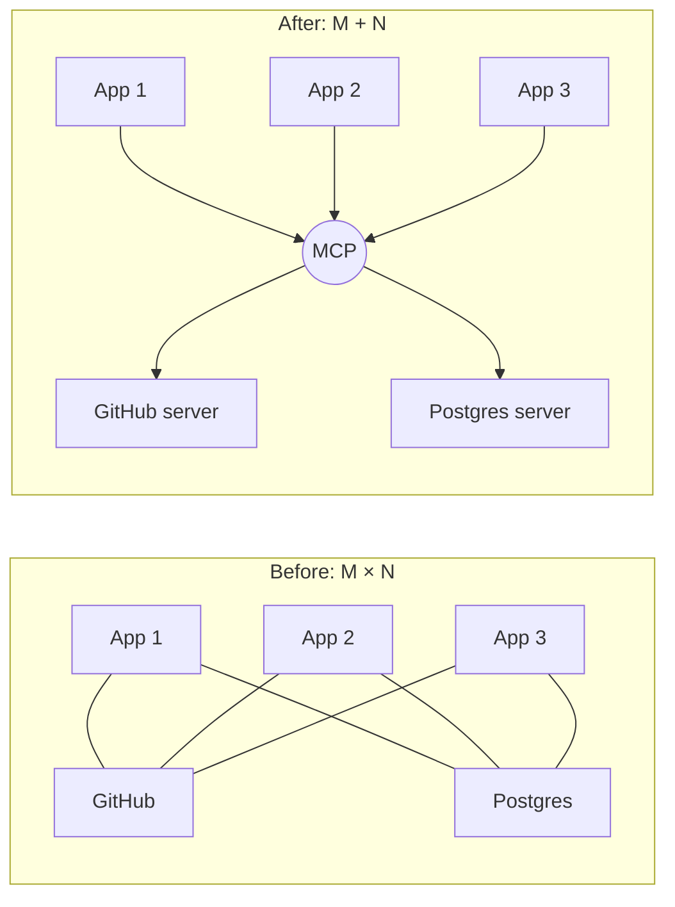
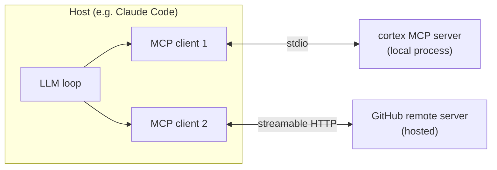
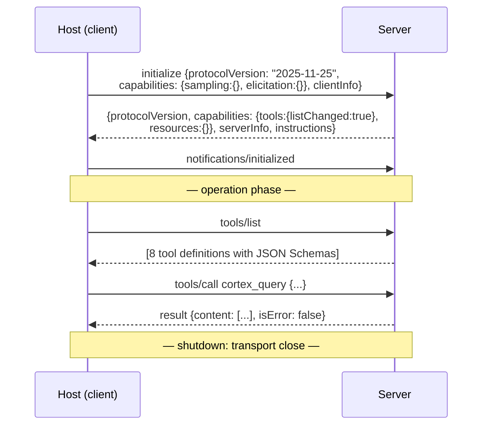
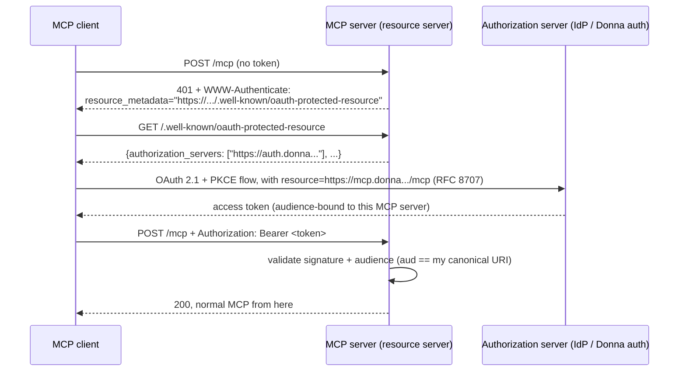
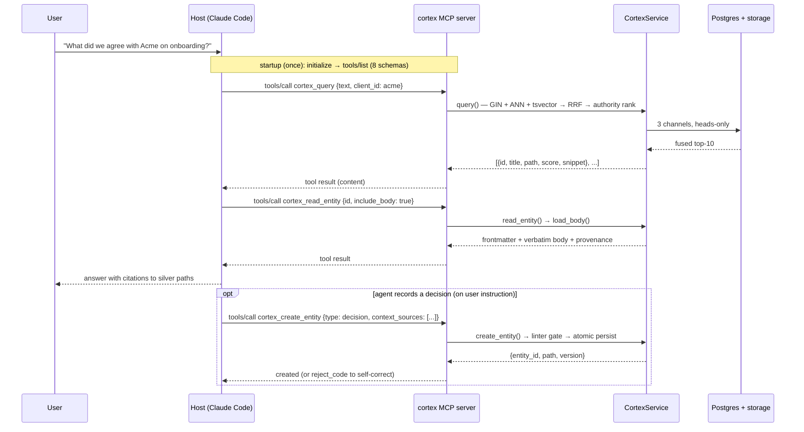

# MCP Implementation Guide — Theory + Practice

An educational, end-to-end walkthrough of the Model Context Protocol:
what it is, how the architecture works on the wire, how the industry
implements it, and how we apply all of it to the Cortex MCP server
(plan: [`00f`](./00f%20-%20silver-completion-plan.md) Phase 4b).

Written 2026-06-11, verified against the **2025-11-25 spec revision**
(current) and the field's reference implementations
([github/github-mcp-server](https://github.com/github/github-mcp-server),
the official Python SDK, FastMCP v3).

Audience: anyone on the team implementing or reviewing Phase 4b, or
building any future MCP surface for Donna.

---

## Part I — Theory

### 1. The problem MCP solves

Before MCP, connecting M AI applications to N tools/data sources meant
**M × N custom integrations** — every chat app wrote its own GitHub
plugin, its own Postgres plugin, its own filesystem plugin, each with
a proprietary function-calling glue layer.

MCP (open-sourced by Anthropic, 2024-11-25) collapses that to
**M + N**: every AI app implements one client protocol, every
tool/data source implements one server protocol, and any client can
talk to any server. The standard analogy is USB-C: one port, any
device.



For Cortex this is exactly the win: we implement **one** server, and
Claude Code, Cursor, the Obsidian plugin, the `donna` CLI, and any
future agent get the full `cortex.*` surface for free — no per-client
integration.

### 2. The three roles: host, client, server

MCP defines three distinct roles. The naming trips people up — the
**client is not the app**, it's a component *inside* the app:

| Role | What it is | Examples |
|---|---|---|
| **Host** | The user-facing AI application. Orchestrates the LLM, owns consent/UI, instantiates clients | Claude Desktop, Claude Code, Cursor, the Donna desktop app |
| **Client** | A protocol component inside the host. Maintains a **1:1 stateful connection** with exactly one server | one per configured server entry |
| **Server** | A process exposing capabilities (tools/resources/prompts) over the protocol | github-mcp-server, our `donna.cortex.mcp` |



Key consequence of 1:1 — a host with five configured servers runs
five clients. Servers never see each other; composition happens in
the host. (This is why the gate logic must live **in the server** —
the host will happily call whatever tools exist.)

### 3. The wire: JSON-RPC 2.0

Everything in MCP is JSON-RPC 2.0 messages — requests, responses, and
notifications — regardless of transport:

```json
// host→server: request
{"jsonrpc": "2.0", "id": 7, "method": "tools/call",
 "params": {"name": "cortex_query",
            "arguments": {"text": "Acme onboarding status"}}}

// server→host: response
{"jsonrpc": "2.0", "id": 7,
 "result": {"content": [{"type": "text", "text": "..."}],
            "isError": false}}

// either direction: notification (no id, no response expected)
{"jsonrpc": "2.0", "method": "notifications/tools/list_changed"}
```

Note `isError: false` *inside the result*: MCP distinguishes
**protocol errors** (JSON-RPC error object — malformed request,
unknown method) from **tool execution errors** (`isError: true` with
a text payload the *LLM* gets to read and react to). This is exactly
where Cortex reject codes belong — a lint failure is a tool result
the agent can self-correct from, not a protocol failure.

### 4. The primitives

Servers expose three primitives; clients expose three back. The
control taxonomy is the most useful mental model — *who decides when
it's used*:

| Primitive | Direction | Controlled by | What it is |
|---|---|---|---|
| **Tools** | server → host | **model** | functions the LLM decides to call (POST-like, side effects allowed) |
| **Resources** | server → host | **application** | URI-addressed read-only data the host attaches as context (GET-like) |
| **Prompts** | server → host | **user** | parameterized templates the user explicitly invokes (slash commands) |
| **Sampling** | client → server | model via client | server asks the *host's* LLM to complete something — server-side agent loops without owning an API key |
| **Elicitation** | client → server | user via client | server asks the user for structured input mid-operation (since 2025-11-25 also URL mode: send the user to a browser for OAuth/payment) |
| **Roots** | client → server | application | client tells the server which filesystem/URI boundaries it may operate in |

Plus utilities: logging, progress notifications, cancellation,
ping, completion (argument autocomplete), and — since 2025-11-25,
experimental — **tasks** (call-now-fetch-later for long-running
requests, with `tasks/get`, `tasks/result`, `tasks/list`,
`tasks/cancel` and states `working → input_required → completed /
failed / cancelled`).

For Cortex v1 we use **tools only** — the right call for an 8-method
write/query surface. Natural later fits: `_index.md`/`_log.md` as
**resources** (they're read-only context by definition), "create a
decision" as a **prompt** template, and `tasks` for a long
`cortex.eval_run`.

### 5. Lifecycle: initialize → operate → shutdown

Every connection starts with a capability-negotiation handshake.
Nothing works before it:



Three things are negotiated:

1. **Protocol version** — client proposes, server answers with what
   it speaks; mismatch → disconnect. (On HTTP, subsequent requests
   carry the negotiated version in an `MCP-Protocol-Version` header.)
2. **Capabilities** — features are opt-in flags, both directions.
   A server that never declares `tools` will never get `tools/call`;
   a client that doesn't declare `sampling` can't be asked to sample.
   New spec features (e.g. tasks) ride the same mechanism — that's
   how the protocol evolves without breaking old peers.
3. **Identity + instructions** — `serverInfo` and an optional
   `instructions` string the host may inject into the system prompt.
   (We use it: one paragraph on the closed type vocabulary and the
   linter contract.)

### 6. Transports

Two official transports carry the JSON-RPC stream:

| | **stdio** | **Streamable HTTP** |
|---|---|---|
| How | host spawns server as subprocess; newline-delimited JSON-RPC over stdin/stdout | single endpoint (e.g. `/mcp`) accepting POST (+ optional GET for server-initiated streams); responses are plain JSON or upgrade to SSE for streaming |
| Session | the process *is* the session | `Mcp-Session-Id` header, or stateless mode |
| Auth | none on the wire — environment variables, process trust | `Authorization` header — full OAuth 2.1 (see §7) |
| Scale | one process per client | many clients per server, horizontally scalable when stateless |
| Use | local/desktop/self-host, single user | cloud, multi-tenant, anything behind a gateway |

History note you'll hit in older tutorials: the original remote
transport was **HTTP+SSE** (two endpoints, one for events, one for
posts). It was replaced by Streamable HTTP in the 2025-03-26 revision
and is being sunset across providers in 2026. **Never build on SSE
transport**; the SSE *response format* inside Streamable HTTP is fine
(it's how streaming works there).

Rule of thumb the entire industry follows: **stdio until you need a
URL, then Streamable HTTP — never both behaviors in two codebases.**
Good SDKs make the transport a single argument at `run()` time, which
is why our Phase 4b ships both from one server object.

### 7. Authorization (the part most tutorials get wrong)

Stdio servers don't do wire auth — credentials come from the
environment (this is why every local server config has an `env` block
with an API key, and why ours has `DONNA_WORKSPACE_ID`).

For HTTP servers, the 2025-06-18 revision settled the model after two
iterations: **the MCP server is an OAuth 2.1 *resource server*, never
an authorization server.** It validates tokens; it does not issue
them. The discovery dance:



The load-bearing pieces:

- **RFC 9728 Protected Resource Metadata** — the server publishes
  *where to get tokens* (`/.well-known/oauth-protected-resource`).
  Mandatory since 2025-06-18.
- **RFC 8707 Resource Indicators** — the client binds the token to
  this specific server (`resource=` parameter); the server **must**
  validate audience. Kills token mis-redemption: a token for the
  Cortex server is useless against any other API.
- **No token passthrough** — a hard spec prohibition: the MCP server
  must never forward the client's token to upstream services, and
  must never accept tokens issued for someone else. (This is the
  "confused deputy" defense.)
- 2025-11-25 added OpenID Connect Discovery support for finding the
  authorization server — relevant for enterprise IdPs.

Pragmatic reality check: static API keys in the `Authorization`
header are still everywhere (GitHub's hosted server accepts PATs).
That's our v1; the PRM/OAuth dance is our v2 when arbitrary external
MCP clients connect to Donna cloud — phased exactly as
[`00f`](./00f%20-%20silver-completion-plan.md) §4b records.

### 8. Spec revision history (what "current" means)

| Revision | Highlights |
|---|---|
| 2024-11-05 | initial public protocol: tools/resources/prompts, stdio + HTTP+SSE |
| 2025-03-26 | **Streamable HTTP** replaces HTTP+SSE; OAuth framework v1; audio content; tool annotations |
| 2025-06-18 | auth recast: **server = resource server**, RFC 9728 PRM mandatory, RFC 8707 audience binding; **elicitation** introduced; structured tool output; SSE transport deprecated |
| **2025-11-25** (current) | **tasks** (experimental, durable async requests); **sampling with tools** (server-side agent loops); URL-mode elicitation; OIDC discovery; tool-naming guidance; backward compatible |

Versioning is date-based and negotiated per connection (§5), so
servers written against 2025-06-18 keep working — new features are
capability-gated, not breaking.

---

## Part II — How the industry implements it

### 9. The reference shape: github-mcp-server

The most-studied open-source server (Go, ~162 tools). Its
architecture decisions became the de-facto conventions:

| Decision | Detail | What we copy |
|---|---|---|
| **Protocol bridge** | tools contain zero business logic — each translates MCP call ⇄ GitHub REST/GraphQL call | tools → `CortexService`, nothing else |
| **Dual deployment** | same binary: `github-mcp-server stdio` locally (PAT via env), GitHub-hosted Streamable HTTP remotely (OAuth/PAT header) | one server object, `stdio` + `streamable-http` |
| **Toolsets** | 162 tools grouped (`repos`, `issues`, …), enabled via `--toolsets` — *"enabling only what you need helps the LLM with tool choice and reduces context size"* | not needed at 8 tools; the principle (small surface) we already satisfy |
| **`--read-only` flag** | strips all mutating tools | our `--read-only` → 4 tools |
| **Central inventory** | one registry applying config/flags/scopes filtering | the registry idiom we already use for TypeSpecs |

Other production servers (Sentry, Linear, Grafana, Cloudflare's
fleet) repeat the same shape: thin tools, dual transport or
remote-only, OAuth on the remote, aggressive tool-count discipline.

### 10. The Python idiom: FastMCP

FastMCP is the decorator-based server API that became the standard
Python implementation pattern. Important 2026 packaging nuance: the
**standalone `fastmcp` package (v3)** is the actively maintained
successor of the `mcp.server.fastmcp` module bundled inside the
official `mcp` SDK — import from `fastmcp` directly.

The whole programming model in one block:

```python
from fastmcp import FastMCP

mcp = FastMCP("donna-cortex")

@mcp.tool
def cortex_query(text: str, type: str | None = None, limit: int = 10) -> dict:
    """Hybrid search over the Cortex silver layer.

    Fuses graph (entity_refs), vector (pgvector ANN) and keyword
    (tsvector) channels with RRF. Returns heads only unless
    include_superseded=true.
    """
    ...

if __name__ == "__main__":
    mcp.run()                                   # stdio (default)
    # mcp.run(transport="streamable-http", host="0.0.0.0", port=8001)
```

What the decorator does: the function signature + type hints become
the tool's **JSON Schema**, the docstring becomes its
**description**. This is why docstring quality is an engineering
concern, not documentation polish — it's the only thing the LLM sees
when deciding *whether and how* to call you.

Production posture for the HTTP transport (the documented best
practice): `stateless_http=True, json_response=True` for horizontal
scaling, mount into an existing ASGI app via `mcp.http_app()` when
you have one, validate `Origin`, expose `Mcp-Session-Id` in CORS.

### 11. Field-tested design rules

Distilled from the reference servers + official guidance:

1. **Few, well-described tools beat many thin ones.** Every tool
   definition consumes context in *every* request the host makes.
   GitHub needs toolsets to manage 162; we hold the line at 8.
2. **Errors are content, not exceptions.** Return `isError: true`
   with a machine-readable payload. Our reject codes
   (`UNKNOWN_TYPE`, `INSUFFICIENT_EVIDENCE`, …) map perfectly — the
   agent reads the code, fixes its payload, retries. A raised
   exception would surface as an opaque protocol error and kill the
   loop instead of correcting it.
3. **Put the contract in the descriptions.** Closed vocabularies,
   required fields, "use supersedes, never edit" — stated in the tool
   description means the agent self-corrects *before* the call.
   (2025-11-25 even added official tool-naming guidance — snake_case,
   verb-led, unambiguous.)
4. **First-party servers call the service layer in-process;
   third-party bridges wrap the API.** GitHub wraps REST because the
   API is its only door. We own the data layer, so tools call
   `CortexService` directly — no double hop, no double auth, works
   without the web container.
5. **One codebase, transport as a flag.** stdio-only servers get
   wrapped by `mcp-proxy` in enterprises that need a gateway — design
   for both transports up front and nobody ever needs to wrap you.
6. **Stateless HTTP unless you need sessions.** Sessions buy
   elicitation/sampling continuity; they cost sticky routing. With
   tools-only v1, stateless is free scaling.
7. **Least privilege is a flag away.** Read-only mode is ~5 lines and
   the single highest-leverage safety feature for agent deployments.

### 12. Security checklist (spec "MUST"s + field practice)

- ✅ Validate `Origin` on HTTP (DNS-rebinding defense); bind dev
  servers to `127.0.0.1`, not `0.0.0.0`.
- ✅ Validate token **audience** (RFC 8707) — reject tokens minted
  for other services.
- ✅ Never pass the client's token upstream (confused-deputy
  prohibition).
- ✅ Treat tool *descriptions from servers you don't control* as
  untrusted input (prompt-injection vector) — as a server author,
  keep descriptions free of instructions to exfiltrate.
- ✅ Multi-tenant: scope every query by the authenticated
  `(user, workspace)` — for us this is `WorkspaceMiddleware`
  semantics reproduced at the MCP boundary, and the linter gate
  unchanged beneath it (the gate is the writer-agnostic wall; MCP is
  just another writer).
- ✅ Rate-limit writes per author (our pushback #13 watchpoint).

---

## Part III — Practice: the Cortex MCP server, end to end

### 13. Module layout

```
server/donna/cortex/mcp/
├── __init__.py
├── server.py        # FastMCP app + 8 tools (thin adapters)
├── auth.py          # v1: workspace token → (user, workspace)
└── __main__.py      # python -m donna.cortex.mcp [--read-only] [--http]
```

### 14. The server (`server.py`) — annotated sketch

```python
"""All tools are thin: parse → CortexService → serialize.

The service owns transactions, the linter gate, and side effects —
identical behavior whether the call arrives via DRF or MCP.
"""
from fastmcp import FastMCP

mcp = FastMCP(
    "donna-cortex",
    instructions=(
        "Donna's organizational memory (silver layer). "
        "12 closed entity types; writes are linted — on reject, "
        "read the reject_code and fix the payload. Existing pages "
        "are immutable: never edit, supersede."
    ),
)

READ_ONLY_TOOLS = {"cortex_query", "cortex_read_entity",
                   "cortex_get_context", "cortex_health"}


@mcp.tool
def cortex_query(
    text: str,
    type: str | None = None,
    client_id: str | None = None,
    project_id: str | None = None,
    occurred_after: str | None = None,
    limit: int = 10,
) -> dict:
    """Hybrid search: graph + vector + keyword channels fused with
    RRF, ranked by authority + recency. Heads only (latest version
    of living sources). Returns [{id, type, title, path, score,
    snippet}]."""
    svc = _service()
    return svc.query(text=text, type=type, client_id=client_id,
                     project_id=project_id,
                     occurred_after=occurred_after, limit=limit)


@mcp.tool
def cortex_create_entity(payload: dict) -> dict:
    """Create an immutable silver entity through the linter gate.

    payload: frontmatter fields + body_md. Closed type vocabulary
    (meeting, email, chat, doc, ticket, clip, note, person, org,
    project, concept, decision). On lint failure returns
    {rejected: true, reject_code, detail} — fix and retry.
    decision requires context_sources (evidence)."""
    svc = _service()
    result = svc.create_entity(payload)        # never raises on lint
    return result                              # reject = content (§11.2)

# ... read_entity, update_entity (R1: extensions only), get_context,
#     linter_check, eval_run, health — same shape ...
```

Implementation notes:

- `_service()` resolves the workspace-bound `CortexService` from the
  connection context — env binding on stdio, token claims on HTTP.
- Lint rejects **return**, never raise — they must reach the model as
  tool content (`isError`/payload), so the agent can self-correct.
- Read-only filtering: register conditionally at startup based on the
  flag — the GitHub `--read-only` idiom.

### 15. The entrypoint (`__main__.py`)

```python
import argparse, django, os

def main() -> None:
    os.environ.setdefault("DJANGO_SETTINGS_MODULE", "donna.settings")
    django.setup()                      # in-process: ORM, storage,
                                        # linter — no web container
    from donna.cortex.mcp.server import build_server

    p = argparse.ArgumentParser()
    p.add_argument("--read-only", action="store_true")
    p.add_argument("--http", action="store_true")
    args = p.parse_args()

    mcp = build_server(read_only=args.read_only)
    if args.http:                       # cloud / docker service
        mcp.run(transport="streamable-http",
                host="0.0.0.0", port=8001,
                stateless_http=True, json_response=True)
    else:                               # local: Claude Code spawns us
        mcp.run()                       # stdio

if __name__ == "__main__":
    main()
```

`django.setup()` before any model import is the one Django-specific
trick; everything below it is vanilla FastMCP.

### 16. Client configuration (what users actually touch)

Local (Claude Code / Cursor — `.mcp.json` / `mcp.json`):

```json
{
  "mcpServers": {
    "donna-cortex": {
      "command": "uv",
      "args": ["run", "python", "-m", "donna.cortex.mcp"],
      "env": {
        "DONNA_WORKSPACE_ID": "ws_01...",
        "DATABASE_URL": "postgres://..."
      }
    }
  }
}
```

Cloud (any remote-capable host):

```json
{
  "mcpServers": {
    "donna-cortex": {
      "url": "https://api.donna.example/mcp",
      "headers": {"Authorization": "Bearer dna_ws_..."}
    }
  }
}
```

v1 token = static workspace API key (GitHub-PAT-style). v2 swaps the
`headers` block for the OAuth discovery dance of §7 with **zero
changes to tools** — auth is a transport concern, which is the whole
point of layering it this way.

### 17. Testing — the in-memory client

The SDK ships a client that connects to the server object directly —
no subprocess, no socket, full protocol fidelity:

```python
from fastmcp import Client

async def test_lint_reject_is_content_not_exception(server):
    async with Client(server) as c:
        res = await c.call_tool("cortex_create_entity",
                                {"payload": {"type": "blogpost"}})
        body = res.data
        assert body["rejected"] and body["reject_code"] == "UNKNOWN_TYPE"

async def test_read_only_exposes_four(ro_server):
    async with Client(ro_server) as c:
        tools = await c.list_tools()
        assert {t.name for t in tools} == READ_ONLY_TOOLS
```

The Phase 4b suite (per [`00f`](./00f%20-%20silver-completion-plan.md)):
8 tools listed (4 read-only), **transport parity** (same reject code
via MCP tool and DRF route — both adapters over one service), tenant
isolation by workspace binding, lint failure as structured content.

### 18. Deployment

| Mode | How |
|---|---|
| Local / self-host | host spawns `python -m donna.cortex.mcp` (stdio) — works with just Postgres up |
| Cloud | `mcp` service in docker-compose (entrypoint role alongside `web | worker | beat`), streamable HTTP on :8001, behind the same ingress; stateless → scale horizontally |
| Hardening | Origin check, CORS exposing `Mcp-Session-Id`, nginx SSE buffering off, audience validation when v2 lands |

### 19. The full loop, end to end

What actually happens when a user asks the agent a question — every
piece of this guide in one diagram:



The architecture in [`00e`](./00e%20-%20end-to-end-example.md)'s read
path is this exact flow — MCP is the concrete carrier of the abstract
"agent calls the API" steps there.

---

## 20. Further reading

- Spec (current): modelcontextprotocol.io/specification/2025-11-25
- Authorization deep-dive: spec §basic/authorization (RFC 9728/8707)
- Python SDK / FastMCP: modelcontextprotocol.github.io/python-sdk, gofastmcp.com
- Reference server: github.com/github/github-mcp-server (architecture, toolsets, dual deployment)
- Our application: [`00f`](./00f%20-%20silver-completion-plan.md) §4b — the Phase 4b work items this guide grounds
