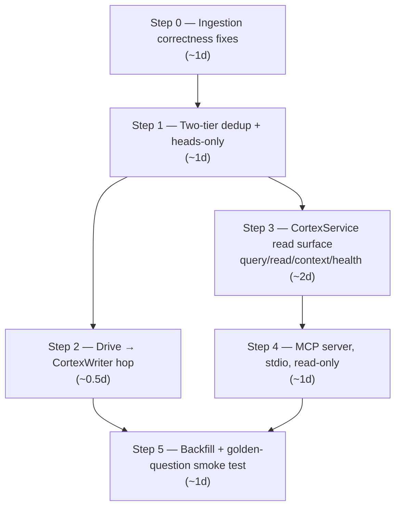

# "Ask Donna" Roadmap — the critical path to question answering

The narrowest end-to-end cut through
[`00f`](./00f%20-%20silver-completion-plan.md) that reaches one
concrete capability: **ask questions about ongoing projects and get
cited, context-aggregated answers from the silver layer.** Everything
not on that path is explicitly deferred (§5) — nothing is dropped,
only re-sequenced.

Drafted 2026-06-11 against the actual code (not the docs' memory of
it — see the correction in §2).

---

## 1. The target

A developer opens Cursor / Claude Code with the `donna-cortex` MCP
server configured and asks:

> "What's the status of the Acme onboarding? What did we agree in the
> last meeting, and is anything contradicting it in email?"

and the agent answers by: `cortex_query` (hybrid retrieval over
meetings + emails + docs) → `cortex_get_context` (expand edges +
entity refs) → `cortex_read_entity` (verbatim bodies) → answer **with
citations to silver paths**.

**Milestone exit criterion:** 10 golden questions about real ongoing
projects answered correctly from real ingested data, through the MCP
server, with citations. That's it. No vault, no synthesis, no
maintenance workers.

## 2. What already works today (verified in code)

| Piece | State | Evidence |
|---|---|---|
| Write pipeline, 11 steps | ✅ | `pipeline.py`, 11/11 tests green |
| Fathom → Cortex | ✅ | `fathom/tasks.py` → `CortexWriter().write(package)` |
| **Gmail → Cortex** | ✅ **already wired** — 00f's snapshot was stale | `google/mail/tasks.py:116` calls `CortexWriter().write(package)` |
| Gmail historical sync | ✅ machinery exists | `sync_gmail_connection` with cold-start + watermarks, beat fanout |
| Drive ingestion → bronze | ✅ | `ingest_drive_file`, `_sync_everything`, beat fanout |
| Drive → Cortex | ❌ **the only missing connector hop** | no `CortexWriter` call in `drive/tasks.py` |
| Embeddings at write | ✅ | BGE-small, per-type samplers |
| Index maintenance | ✅ | `cortex_sync --reindex-embeddings --rebuild-clusters --reap-orphans` |
| Read surface (query/read/context) | ❌ | nothing exists — no service, no API, no MCP |
| Dedup of living sources | ❌ | re-synced Gmail threads create duplicate rows today |

The two real gaps between today and the target: **(a) nothing can
read the layer, (b) re-ingestion duplicates living sources.** Plus
one connector hop and a couple of latent ingestion bugs.

## 3. Critical path — six steps

Dedup (S1) must precede both the backfill and the read surface —
otherwise the backfill writes duplicates and `query` has no
heads-only semantics to filter them.

### Step 0 — Ingestion correctness fixes (~1d)

The subset of 00f Phase 0 that protects a backfill writing thousands
of rows. Skip the rest of Phase 0 for now.

| Fix | Why it's on the critical path |
|---|---|
| #4 GLiNER `body_md` AttributeError | crashes step 9 the moment body NER is enabled |
| #3 `_spawn` through linter + `CortexEntity.objects.save_with_reverse_edges()` | backfill spawns hundreds of person/org stubs; today's non-atomic double-write corrupts on partial failure |
| `CortexEntityManager` silent `return` on missing edge targets → log + raise in DEBUG | a quiet edge loss during backfill is unfindable later |
| #14 cosine floor on write-time cluster assign | cheap (one param) and the backfill is exactly the novel-topic flood that mis-files without it |

*Deferred from Phase 0:* the ~550-line dead-code deletion and the
folder-resolver collapse — valuable, zero effect on Q&A. Do them as a
parallel cleanup PR whenever.

**Exit:** existing 11 tests + 4 new ones green.

### Step 1 — Two-tier dedup + heads-only (~1d)

The Living Source Policy core (00b #9), minus the bronze work:

- `pipeline.py` step 8: `(workspace, source)` head lookup → same
  `content_hash` = DUPLICATE; different = new version with
  `supersedes=[head]`.
- `CortexEntityManager._assign_superseded_by`: ancestor keeps body,
  loses `doc_embedding` + `cluster_id`.
- Migration: partial indexes `WHERE superseded_by IS NULL` on
  `(workspace, type, occurred_at)` + the `entity_refs` GIN.
- All read paths default heads-only.

*Deferred from Phase 1:* versioned bronze keys + `.extracted.md`
sidecar + spec amendments — bronze hygiene matters for the evidence
locker, not for answering questions. They rejoin in the 00f sequence
later.

**Exit:** replay test (row count unchanged), grown-thread test
(chain of 2, head correct, ancestor de-weighted).

### Step 2 — Drive → CortexWriter (~0.5d)

The single missing connector hop (Gmail turned out to be done):

- `drive/tasks.py ingest_drive_file`: append the same
  try/except cortex hop as Fathom/Gmail.
- Drive adapter: emit `mime_type` + `owner` in `metadata()` so `doc`
  extensions fill and the owner becomes an entity ref.

**Exit:** Drive PDF fixture → linted `doc` entity with refs,
integration test green.

### Step 3 — CortexService read surface (~2d)

The read half of 00f Phase 4a — `services.py` with four methods
(create/update/lint wait for the write milestone):

| Method | What it does |
|---|---|
| `query` | 3 channels — `entity_refs` GIN, pgvector ANN, **new** `tsvector` generated column — fused with RRF (k=60), ranked by `TYPE_AUTHORITY` + recency; heads-only; filters: type, client, project, `occurred_after` |
| `read_entity` | row + lazy `load_body()` + provenance |
| `get_context` | edge + entity-ref expansion, depth ≤ 2 — **this is the "aggregating context" piece**: from one hit, pull the meeting's attendees, the project page, contradicting emails |
| `health` | counts per type/scope — sanity check after backfill |

One migration: `tsvector` column + GIN index.

**Exit:** RRF fixture test (keyword-only hit + ref-only hit both
surface), heads-only test, depth-2 context walk test.

### Step 4 — MCP server, stdio, read-only (~1d)

The minimal carrier for *you asking questions* — 00f Phase 4b cut to
its read half (the full theory + code sketches are in
[`00g`](./00g%20-%20mcp-implementation-guide.md) Part III):

- `donna/cortex/mcp/` — FastMCP, **4 tools** (`cortex_query`,
  `cortex_read_entity`, `cortex_get_context`, `cortex_health`),
  stdio transport, workspace via `DONNA_WORKSPACE_ID`,
  `django.setup()` in `__main__` (works with just Postgres up).
- `.mcp.json` entry for Cursor / Claude Code.

*Deferred:* write tools, DRF views, streamable HTTP, OAuth — none
needed to ask questions.

**Exit:** in-memory client lists 4 tools; query→read round-trip
returns a cited body; tenant isolation test.

### Step 5 — Backfill + golden-question smoke test (~1d)

Put real history in, then prove the loop:

1. Run the existing sync machinery over history: Gmail cold-start
   (`sync_gmail_connection` already supports it), Drive
   `_sync_everything`, Fathom (webhook-driven — backfill what its API
   allows).
2. `cortex_sync --reindex-embeddings --rebuild-clusters` to settle
   the index.
3. `cortex_health` — verify counts per type look like reality.
4. Write the first **10 golden questions** about actual ongoing
   projects ("what did we agree with X", "who owns Y", "latest state
   of Z") and ask them through Cursor with the MCP server attached.
   Manually grade. Record the misses — they seed the Phase 6 eval
   harness later.

**Exit:** ≥7/10 answered correctly with citations. Below that, the
misses tell us exactly which channel (graph/vector/keyword) or which
ingestion gap to fix before calling the milestone done.

## 4. Timeline

| Day | Work |
|---|---|
| 1 | Step 0 — ingestion fixes + tests |
| 2 | Step 1 — dedup + heads-only + migration |
| 3 (am) | Step 2 — Drive hop |
| 3 (pm) – 5 | Step 3 — service + tsvector + RRF + tests |
| 6 | Step 4 — MCP server + client config |
| 7 | Step 5 — backfill + golden questions |

**~7 working days to "ask Donna about ongoing projects."**
(vs ~15 for full 00f — this is the front half, nothing wasted.)

## 5. Deliberately deferred — and why it's safe

| Deferred | From | Why safe for Q&A |
|---|---|---|
| Dead-code deletion, resolver collapse, `build_extensions` → TypeSpec hook | Phase 0 | invisible at runtime; parallel cleanup PR |
| Versioned bronze keys, `.extracted.md` sidecar, spec amendments | Phase 1 | bronze hygiene ≠ retrieval; OCR already runs in-pipeline |
| Cluster identity continuity (#15) | Phase 3 | cluster UUIDs decorate results; only synthesis *anchors* on them |
| Write tools, DRF endpoints, `update/lint` methods | Phase 4 | asking ≠ writing; agent writes are the next milestone |
| Scope suggestion ladder + promotion (4c) + structure proposals | Phase 4/6 | workspace-scoped query answers fine from one pot; per-client filing matters once agents *file*, not just ask |
| Streamable HTTP + OAuth | Phase 4b | stdio + env binding covers single-operator local use |
| Vault projection + rebuild | Phase 5 | answers cite paths from Postgres; files can materialize later |
| R6/R7/R8 workers | Phase 6 | staleness/decay are quality refinements, not gates |
| Full eval harness + CI gate | Phase 6 | the 10 manual golden questions ARE its seed; automate after |

After this milestone, resume the 00f order: bronze hygiene →
cluster continuity → write surface + DRF + HTTP transport → vault →
maintenance + eval automation.

## 6. Corrections this roadmap feeds back

- 00f §2 snapshot said "Connectors → Cortex: Fathom only" —
  **stale**: Gmail is wired (`mail/tasks.py:116`). 00f Phase 2
  shrinks to Drive-only (0.5d), core total ~15d → ~14.5d.
