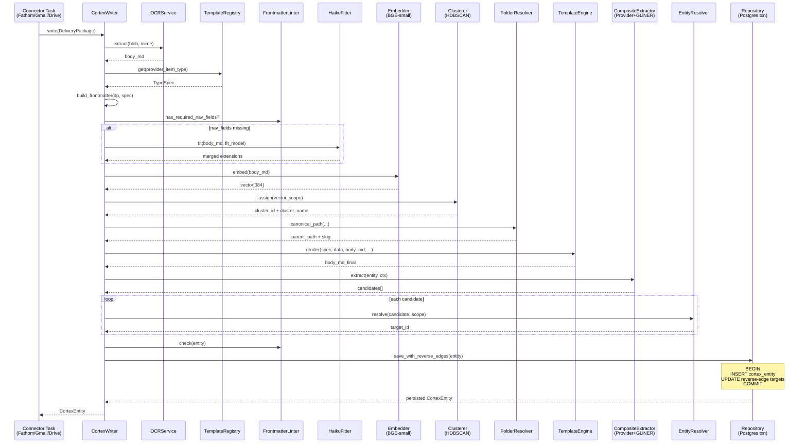

# CortexWriter Facade — 11-Step Pipeline

`CortexWriter.write(dp: DeliveryPackage) → CortexEntity` is the single
entry point for the whole Cortex layer. It runs eleven well-defined
steps. The orchestrator delegates every domain decision to an injected
collaborator; the steps below describe what each step does and why.

## Sequence diagram



## The 11 steps in plain English

Recurring fixture: Fathom meeting `Acme onboarding call`, host
`alice@acme.com`, attendees `[alice@acme.com, bob@example.com]`, body
mentions Stripe.

### 1. OCR / markdownify

**Plain English:** turn the raw bytes into a uniform markdown string.

JSON-shaped bronze (Fathom) → adapter's `to_markdown()`. Binary bronze
(PDF / image) → OCR strategy fallback. Either way the output is
markdown that the next ten steps can consume.

**Example output:** `# Acme onboarding call\n\nDiscussed Stripe…`

### 2. Type resolve + TypeSpec lookup

**Plain English:** which kind of entity is this, and what rules apply?

`registry.get("meeting")` returns a frozen `TypeSpec` — Pydantic
extensions model + Jinja template path + nav fields + folder resolver +
version.

New types → register a TypeSpec; orchestrator unchanged.

### 3. Deterministic frontmatter fill

**Plain English:** provider already knows the host, participants,
duration. Don't waste an LLM call.

`_build_extensions(dp, type_spec)` copies straight from
`adapter.metadata()`:

```python
extensions = {
    "attendees": [{"name": "Alice", "email": "alice@acme.com", "role": "host"}, ...],
    "duration_min": 30,
    "recording_url": "https://...",
}
```

Anti-hallucination root cause: provider-known facts NEVER flow through
an LLM.

### 4. Fitter fallback (only when missing)

**Plain English:** generic PDF or web clip with no provider metadata?
Then (and only then) call the LLM, locked to a Pydantic schema.

```python
if not linter.has_required_nav_fields(extensions, nav_fields):
    if type_spec.fit_model is not None:
        fit = self.fitter.fit(body_md, type_spec.fit_model)
        extensions = merge(extensions, fit)
```

Fathom meetings: `nav_fields=["attendees"]`, attendees present, **skip
fitter**. Drive PDFs: `nav_fields=["doc_type"]`, often missing, **call
fitter**.

### 5. Embed + cluster_assign

**Plain English:** turn the body into a vector, find the closest
existing cluster within the same scope.

```python
embedding = self.embedder.embed(body_md)            # → [0.12, -0.05, …] (384-dim)
cluster_id, cluster_name = self.clusterer.assign(   # nearest-centroid in scope
    embedding, scope,
)
```

Cluster ids are stable UUIDs (uuid5 from the integer label). Names
come from `HaikuNamer` (Anthropic Haiku) given 5 samples from each
centroid.

### 6. Folder placement

**Plain English:** every row gets ONE canonical filesystem location.

`type_spec.folder_resolver.canonical_path(...)` returns the parent
folder (e.g. `clients/acme/projects/onboarding/meetings/2026/06`); the
writer adds a `slug` of the form `{YYYY-MM-DD}-<title-slug>-<sha1[:8]>`.

### 7. Render body via Jinja

**Plain English:** wrap the verbatim body in a uniform frontmatter +
Source footer so agents can compare rows quickly.

```python
body_md_final = self.engine.render(
    type_spec,
    data=extensions,
    body_input=body_md,
    title=dp.title,
    occurred_at=dp.occurred_at,
    source_uri=source_uri,
    bronze_storage_key=bronze_key,
)
```

`StrictUndefined` → missing variables raise (fail loud, not silent
``None`` in output).

### 8. Build entity (unsaved)

**Plain English:** package everything into an ORM object and hash the
body for idempotency.

```python
content_hash = sha256(body_md_final)
new_entity = CortexEntity(
    workspace_id=…, type="meeting", author="donna",
    source="fathom://meeting/rec-1", bronze_storage_key=…,
    occurred_at=…, client_id=…, project_id=…,
    cluster_id=…, doc_embedding=embedding,
    confidence="high", last_synthesized=today,
    title="Acme onboarding call", body_md=body_md_final,
    content_hash=…, extensions=extensions,
)
```

Not yet persisted. Step 10 still can reject.

### 9. Entity extraction + resolution

**Plain English:** the meeting mentions Alice and Acme. Find the
existing person/org rows or spawn new ones, then bind the meeting to
them via `entity_refs[]`.

```python
candidates = self.extractor.extract(entity=new_entity, context=ExtractContext(meta))
for candidate in candidates:
    target_id = self.resolver.resolve(candidate, scope)
    entity_refs.append(str(target_id))
new_entity.entity_refs = entity_refs
```

Result: meeting carries `entity_refs = [alice_id, bob_id, acme_id]`.
Person/org rows know nothing yet — the reverse edge is the
`find_referencing` derived query, not a write.

### 10. Linter gate

**Plain English:** last line of defence. Pydantic + presence of nav
fields + hard rejects (`MISSING_REQUIRED_EXTENSION` for missing
`doc_type` on a doc, `INSUFFICIENT_EVIDENCE` for a concept with <2
sources, etc.).

```python
self.linter.check(new_entity)
```

Raises `LinterError` carrying a closed-vocab `RejectCode`; no DB write.

### 11. Atomic persist

**Plain English:** insert the meeting + append its id to every
referenced row's reverse-edge field in ONE Postgres transaction.

```python
return self.repo.save_with_reverse_edges(new_entity)
```

Three reverse-edge writers fire: `_append_applied_in`,
`_assign_superseded_by`, `_append_contradicts`. Either all succeed or
rollback — no half-graphs.

## What's NOT in CortexWriter

| Concern | Lives in |
|---|---|
| Nightly clustering recompute | `tasks.recluster_workspace` (Celery beat) |
| Read API / route matrix | P9 (`/cortex/index`, `/cortex/log`, `/cortex/entity/{id}`) |
| Vault projection (Mode A) | P10 (`vault_renderer.py`) |
| Agent orchestration | Separate plan |
| Storage-backend write | TODO: `SilverStorage.write()` once MCP API ships |

## Why this shape

| Principle | Where |
|---|---|
| **Facade** | one method, hides 5 subsystems |
| **SRP** | each step calls exactly one collaborator |
| **DIP** | all collaborators are Protocols; injected via `__init__` |
| **OCP** | new type = register a TypeSpec; writer unchanged |
| **Atomic invariant** | reverse-edge writes inside Repository's txn |
| **Idempotent** | `unique (workspace_id, content_hash)` — same body → same row |
| **Fail-loud** | StrictUndefined Jinja, Pydantic linter, savepoint rollback |
