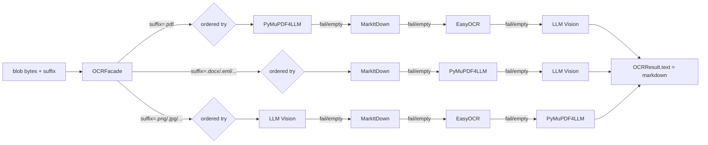

# Subsystem 1 — OCR / markdownify

**Concern:** any source bytes (PDF, image, raw text, JSON) → uniform
markdown the rest of the pipeline can consume.

## Plain English

Every connector hands the pipeline a blob. The blob might be a Fathom
JSON transcript, a Gmail thread JSON, a Drive PDF, a phone-photo
receipt. Cortex only speaks markdown — so this subsystem is the
translator.

Why uniform markdown:
- Same downstream code path for every type
- Easy to embed (just text)
- Easy to lint (Source footer check etc.)
- Easy to render (Jinja renders markdown)

## The four strategies

| Strategy | Best for | Library |
|---|---|---|
| `PyMuPDF4LLMStrategy` | text-native `.pdf` (fastest) | `pymupdf4llm` |
| `MarkItDownStrategy` | `.docx/.pptx/.xlsx/.html/.eml/.zip/...` (widest format) | Microsoft `markitdown` |
| `EasyOCRStrategy` | scanned / phone-photo images | `easyocr` (torch-backed) |
| `LLMStrategy` (vision) | structured images, complex layouts | Anthropic vision via LiteLLM |

Plus a dormant `DoclingStrategy` (IBM Docling) for future tabular content.

## How selection works

`OCRFacade` picks order per mime family and falls back on failure or
empty result:



Each result is validated (`OCRResult.is_valid` — checks for refusal
markers, min char count). If everything fails validation but at least
one returned non-empty text → best-effort fallback to the longest.

## The OCRResult contract

```python
@dataclass(frozen=True)
class OCRResult:
    text: str                       # markdown body
    html: str | None                # GFM-rendered HTML (markdown_to_html)
    provider: str                   # which strategy produced this
    page_count: int                 # for PDFs / images
    title: str | None
    metadata: dict                  # model, token usage, raw extras
    duration_seconds: float

    @property
    def is_empty(self) -> bool: ...
    @property
    def is_valid(self) -> bool: ...
```

## Where the boundary lives

| Layer | Code |
|---|---|
| Core OCR engine | `donna/core/ocr/` (`base.py`, `pymupdf4llm_.py`, `markitdown_.py`, `easyocr_.py`, `llm.py`, `utils.py`) |
| Cortex shim | `donna/cortex/ocr.py` — `OCRService` wraps `donna.core.ocr.create_ocr()` |

Connectors never call OCR directly — they hand bytes to Cortex; Cortex
routes through `OCRService`. This keeps the OCR stack reusable by
other apps (Docupal etc.) without making them depend on Cortex.

## When OCR is skipped

`CortexWriter._body_for(dp)`:

```python
try:
    raw = json.loads(raw_bytes.decode("utf-8"))
except (UnicodeDecodeError, json.JSONDecodeError):
    # binary bronze → OCR
    return self.ocr.extract(raw_bytes, suffix=suffix).text

# JSON bronze → connector adapter knows how to render
adapter = provider.adapter_for(raw)
return adapter.to_markdown()
```

Fathom + Gmail are JSON-shaped → adapter renders directly, no OCR.
Drive PDFs → OCR.

## Why four strategies, not one

| Strategy | Strength | Weakness |
|---|---|---|
| PyMuPDF4LLM | very fast, perfect for text-native PDFs | misses scanned content |
| MarkItDown | widest format coverage | limited PDF intelligence |
| EasyOCR | works offline, handles photos | no layout understanding |
| LLM Vision | best layout / table extraction | costs money, slowest |

The fallback chain gives best-of-all-worlds: cheap+fast first, expensive+smart last. Most PDFs never reach LLM Vision.

## Image enhancement (deferred)

`LLMStrategy(enhance_images=True)` would run OpenCV preprocessing
(deskew, denoise, contrast, sharpen). Currently `image_enhancement.py`
is a stub that raises `NotImplementedError`. Default
`enhance_images=False` skips the import.

## Performance notes

| Strategy | Typical latency |
|---|---|
| PyMuPDF4LLM | ~50ms per page (text-native) |
| MarkItDown | ~100-500ms per doc |
| EasyOCR | ~1-3s per page (CPU), <1s with GPU |
| LLM Vision | ~2-4s per page + API cost |

OCR runs inside the Cortex pipeline; pipelining matters. For big
batches (Drive backfill) the Celery task batches blobs and runs OCR
in parallel.
