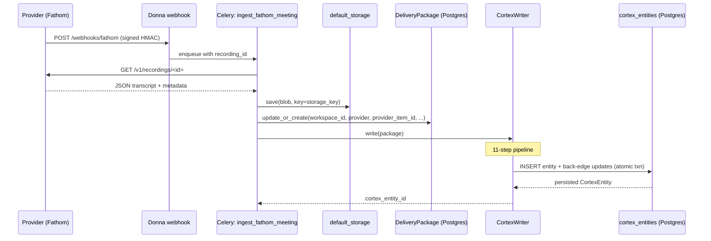

# Bronze → Cortex Trigger

How a row goes from "raw provider blob in S3" to "structured Cortex
entity in Postgres" — and exactly where the handoff happens.

## The path

```
External provider webhook / sync poll
        │
        ▼
Celery task: ingest_<provider>_<item_type>     (e.g. ingest_fathom_meeting)
        │
        ├── 1. fetch raw payload from provider API
        ├── 2. default_storage.save(blob)                    ← BRONZE write
        ├── 3. DeliveryPackage.objects.update_or_create(...)  ← BRONZE row
        │
        └── 4. CortexWriter().write(package)                  ← CORTEX hop
                       │
                       └── 11-step pipeline → CortexEntity row
```

Steps 1-3 are **bronze**. Step 4 is **cortex**.

## Where the trigger lives

Each connector's `tasks.py` carries the cortex hop appended to the
ingest task. Example: `donna/integrations/connectors/fathom/tasks.py`:

```python
package, created = DeliveryPackage.objects.update_or_create(
    workspace_id=workspace_id,
    provider="fathom",
    provider_item_id=recording_id,
    defaults={
        "provider_item_type": "meeting",
        "title": meeting_title,
        "occurred_at": meeting_at,
        "metadata": metadata,
        "storage_key": storage_key,
    },
)

# Cortex hop — best-effort. Bronze write must not be blocked by
# downstream Cortex failures; log + continue.
cortex_entity_id: str | None = None
try:
    from donna.cortex.pipeline import CortexWriter
    cortex_entity = CortexWriter().write(package)
    cortex_entity_id = str(cortex_entity.id)
except Exception:
    logger.exception(
        "cortex_write_failed",
        extra={
            "workspace_id": workspace_id,
            "delivery_package_id": str(package.id),
        },
    )

return {
    "storage_key": storage_key,
    "delivery_package_id": str(package.id),
    "cortex_entity_id": cortex_entity_id,
    "created": created,
}
```

## Best-effort semantics

Cortex failure does NOT block bronze write. The DeliveryPackage row +
blob are durable; the Cortex hop is "best-effort".

Why:
- Bronze layer must always succeed (we need the raw artifact even if
  Cortex fails)
- Cortex idempotency (`unique (workspace_id, content_hash)`) makes
  retries safe
- A separate Celery beat task can re-run the cortex hop over
  DeliveryPackages without a corresponding CortexEntity (post-v1)

## Idempotency at both layers

| Layer | Idempotency key |
|---|---|
| Bronze (`DeliveryPackage`) | `(workspace_id, provider, provider_item_id)` UNIQUE |
| Cortex (`CortexEntity`) | `(workspace_id, content_hash)` UNIQUE |

Re-ingesting the same Fathom meeting:

```
attempt 1:
  DeliveryPackage.update_or_create   → new row
  CortexWriter().write(pkg)          → new cortex row
attempt 2 (same recording_id):
  DeliveryPackage.update_or_create   → same row updated
  CortexWriter().write(pkg)          → same content_hash → upsert OR
                                       IntegrityError caught upstream
```

If the body content changed between attempts, the hash differs → new
Cortex row + old row remains (immutability per R1).

## Connector wiring matrix

| Connector | Status | File |
|---|---|---|
| **Fathom** | ✅ wired (P7) | `connectors/fathom/tasks.py` |
| **Gmail** | ❌ pending (P8) | `connectors/google/mail/tasks.py` |
| **Drive** | ❌ pending (P8) | `connectors/google/drive/tasks.py` |
| Slack / WhatsApp / Linear / Jira / GitHub | future (spec §11.2) | TBD |

P8 = repeat the same 4-line append pattern in Gmail + Drive
`tasks.py`. The pipeline already handles the type mapping (`file → doc`,
`message_thread → chat`).

## Provider → Cortex type mapping

`donna/cortex/pipeline.py:PROVIDER_TYPE_MAP`:

```python
PROVIDER_TYPE_MAP = {
    "meeting":         "meeting",
    "email":           "email",
    "chat":            "chat",
    "message_thread":  "chat",     # old vocab → spec vocab
    "file":            "doc",
    "doc":             "doc",
    "ticket":          "ticket",
    "clip":            "clip",
    "note":            "note",
}
```

Connectors keep their existing `provider_item_type` vocab; the
pipeline normalises to the 12 canonical types. Drive's "file" becomes
Cortex's "doc". WhatsApp's "thread" becomes "chat".

## Source URI scheme

Each connector gets a stable URI scheme for the `source` field on
every Cortex entity:

```python
PROVIDER_URI_SCHEME = {
    "fathom":        "fathom",
    "gmail":         "gmail",
    "google_mail":   "gmail",
    "google_drive":  "gdrive",
    "drive":         "gdrive",
    "linear":        "linear",
    "jira":          "jira",
    "github":        "github",
    "slack":         "slack",
    "whatsapp":      "whatsapp",
}
```

Result: every Cortex row carries `source` like:
- `fathom://meeting/rec-abc123`
- `gmail://email/thread-xyz789`
- `gdrive://doc/file-id-456`

The URI tells the agent (and human auditors) exactly where to find the
original artifact.

## Direct invocation paths

Not all writes come from connectors. The same `CortexWriter` entry
point works for:

| From | Code |
|---|---|
| **Connector task (auto)** | `CortexWriter().write(dp)` after bronze upsert (above) |
| **Backfill script** | `for dp in DeliveryPackage.objects.all(): CortexWriter().write(dp)` |
| **Django shell** | manual interactive testing |
| **Tests** | `donna/cortex/tests/test_pipeline.py` (stubs `_body_for`) |
| **MCP API (P9)** | `cortex.create_entity` will use the same writer |

## Sequence end-to-end



## Webhook → ingest task

The webhook side is connector-specific (Fathom has its own HMAC scheme;
Gmail uses Pub/Sub watches; Drive uses the activity API). All three
funnel into the same shape: bronze write + cortex hop.

See `donna/plans/05-integration-architecture.md` for the connector
framework's webhook protocol.
