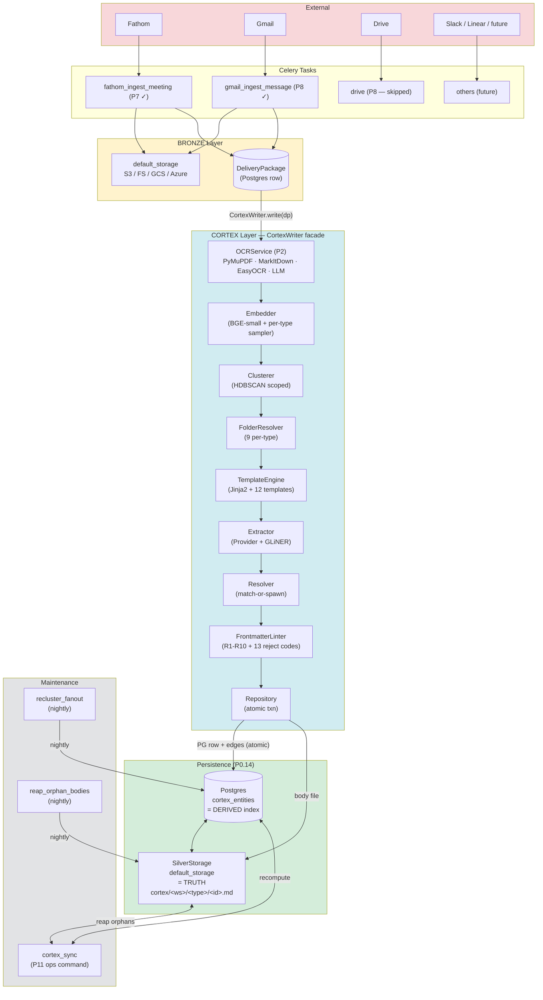
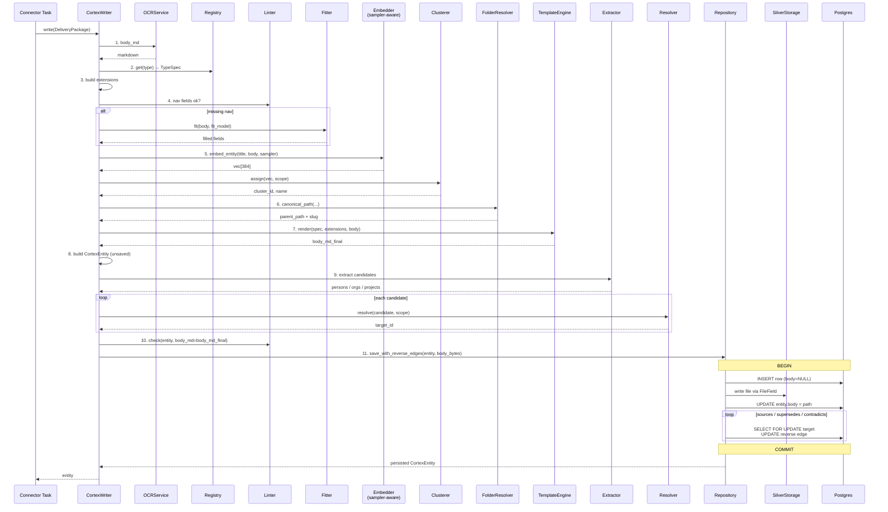
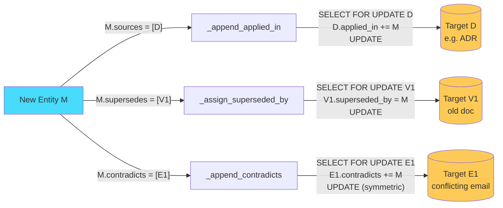
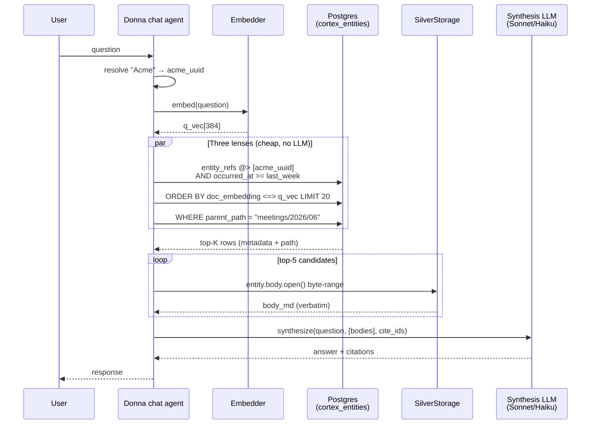
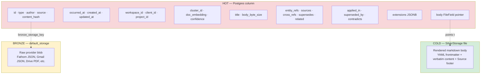
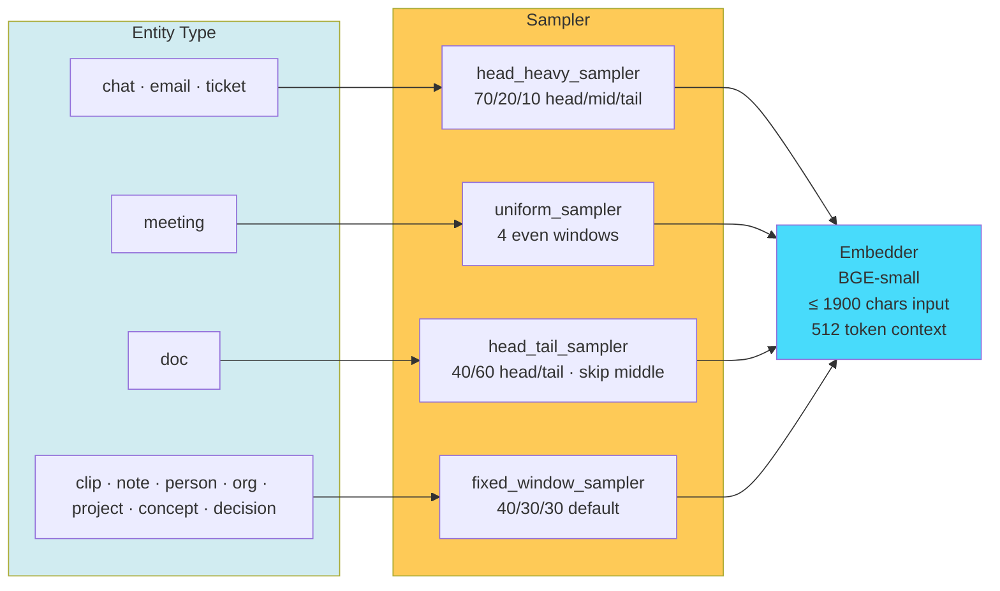
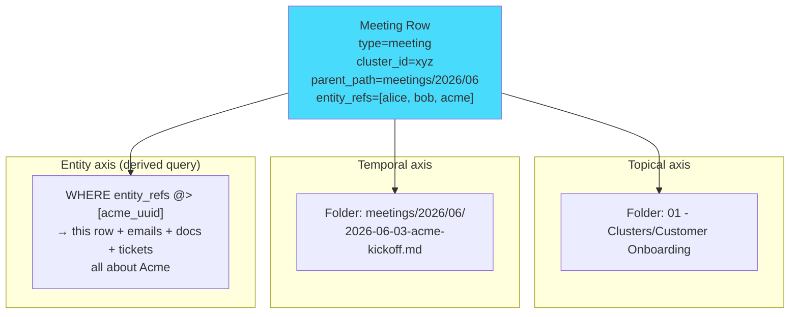
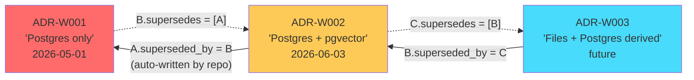

# Cortex — Architecture + Flow Diagrams

> Open this file in Obsidian / VSCode (Mermaid preview) / GitHub —
> all render Mermaid natively. Or paste a block into
> [mermaid.live](https://mermaid.live).

## 1. Architecture overview

End-to-end: external sources → bronze → Cortex pipeline → split
persistence (Postgres = derived index, SilverStorage = truth).

---

## 2. Write flow — CortexWriter.write(dp) 11 steps

---

## 3. Three reverse-edge writers (atomic in same txn)

---

## 4. Read flow — agent answers user question

User: *"What did we discuss with Acme last week?"*

Key: bodies fetched from SilverStorage ONLY for the top-K candidates,
not the whole workspace. Postgres handles filtering; storage handles
content; LLM only synthesizes.

---

## 5. Storage tiers — what lives where

---

## 6. Per-type embedding sampler choice

---

## 7. Acme unified namespace — three axes, one row

Same meeting, three different lenses:

---

## 8. ADR supersession chain

Each ADR row immutable. Agent reading A sees `superseded_by` → walks
chain to current truth C. No deletion; full history preserved.

---

## How to view these

| Viewer | Action |
|---|---|
| Obsidian | open file — Mermaid renders inline in preview pane |
| VSCode | install "Markdown Preview Mermaid Support" → open preview |
| GitHub | open the file on the web — Mermaid renders natively |
| Mermaid Live | paste any block into [mermaid.live](https://mermaid.live) |
| CLI | `npx -p @mermaid-js/mermaid-cli mmdc -i diagrams.md -o diagrams.svg` |
