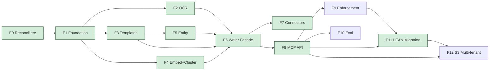

# Cortex Implementation Roadmap

> Ordered phase breakdown for shipping Cortex from current stub state → production. Sister docs: [[Cortex Layer Plan]] (9-step pipeline + 5 subsystems), [[Cortex Universal Silver Specification]] (locked schema + storage + write contract).

## Strategy

12 phases, strict dependency-ordered. Critical path runs F0 → F1 → F2/F3/F4 parallel → F5 → F6 → F7 → F8 → F9/F10/F11 parallel → F12.

**Minimum Viable Cortex (dogfood-ready):** F0 through F8 + F11 = ~25-30 working days. After that qube-digital is the first live workspace.

## Phase summary

| Faza | Scope | Deps | Estimate (zile) | Plan file |
|---|---|---|---|---|
| **F0** | Reconciliere planuri | — | 1 | (this Roadmap §F0) |
| **F1** | Foundation: Pydantic + linter + LocalFSStorage + Postgres + Repository | F0 | 3-5 | [[Cortex F1 - Foundation Plan]] |
| **F2** | OCR integration: finish llm.py + utils.py + wire to connectors | F1 | 2-3 | (this Roadmap §F2) |
| **F3** | TypeSpec + Templates: Jinja2 per type + registry + linter integration | F1 | 3 | (this Roadmap §F3) |
| **F4** | Embed + Cluster: BGE-small + HDBSCAN + Haiku naming | F1 | 2-3 | (this Roadmap §F4) |
| **F5** | Entity extraction: GLiNER + provider + composite resolver | F3 | 3-4 | (this Roadmap §F5) |
| **F6** | CortexWriter facade: orchestrate 5 subsystems + auto-refresh `_index.md` / `_log.md` | F2, F3, F4, F5 | 2-3 | [[Cortex F6 - Writer Facade Plan]] |
| **F7** | Connectors: Gmail / Fathom / Drive wire-up | F6 | 4-5 | [[Cortex F7 - Connectors Plan]] |
| **F8** | MCP API server + GitHubStorage impl | F6 | 3-4 | (this Roadmap §F8) |
| **F9** | Enforcement: Obsidian plugin + CLI + pre-commit hook | F8 | 5-7 | [[Cortex F9 - Enforcement Layer Plan]] |
| **F10** | Eval + Golden Questions runner | F8 | 2 | (this Roadmap §F10) |
| **F11** | qube-digital LEAN vault migration | F8, F9 | 2 (one-shot) | [[Cortex F11 - LEAN Migration Plan]] |
| **F12** | S3Storage + multi-tenant | F8, F11 | 4-5 | (this Roadmap §F12) |

Big phases (own plan files): **F1, F6, F7, F9, F11**. Rest live in this Roadmap.

## Critical path graph

Green nodes = MVP scope (dogfood-ready). F9/F10/F12 = production hardening.

---

## F0 — Reconciliere planuri (1 zi, no code)

**Purpose:** Align [[Cortex Layer Plan]] (existing P1-P10 pipeline) with [[Cortex Universal Silver Specification]] (rev 3 schema + storage) BEFORE writing code. Eliminate plan drift; lock canonical references.

### Sub-tasks

| # | Task | File touched |
|---|---|---|
| 0.1 | Update [[Cortex Layer Plan]] §EntityData to reference `SilverEntity` model from Universal Silver Spec | `Plans/Cortex Layer Plan.md` |
| 0.2 | Update [[Cortex Layer Plan]] §9-step pipeline to call out 12 types (was 9) | `Plans/Cortex Layer Plan.md` |
| 0.3 | Update [[Cortex Layer Plan]] §P2 OCR Subsystem to reflect 4 OCR strategies actually built (easyocr, docling, markitdown, pymupdf4llm) + 1 planned (llm) — not just Docling as originally written | `Plans/Cortex Layer Plan.md` |
| 0.4 | Update [[Cortex Layer Plan]] §P10 VaultRenderer to reference Variant 1 folder structure + Path 1 strict (no daily sync) | `Plans/Cortex Layer Plan.md` |
| 0.5 | Update [[Cortex Universal Silver Specification]] §See also to add [[Cortex Implementation Roadmap]] link | `Plans/Cortex Universal Silver Specification.md` |
| 0.6 | Update [[Architecture]] Active workstreams to reflect Cortex Layer plan + Universal Silver Spec + Roadmap | `Architecture.md` |
| 0.7 | Append `_log.md` with reconciliation event | `_log.md` |

### Verification

- Read each touched file end-to-end; confirm no contradiction between Cortex Layer Plan and Universal Silver Spec on: entity types, edges, storage, write contract
- Confirm 9-step pipeline references new SilverEntity model
- Confirm all phase numbers in this Roadmap align with sub-tasks

### Success criteria

Two source-of-truth docs agree on schema + pipeline. Roadmap visible from Architecture.md status. Zero implementation work — purely planning hygiene.

---

## F2 — OCR integration (2-3 zile)

**Purpose:** Complete the OCR module at `server/donna/core/ocr/` and wire it into the Cortex ingestion pipeline.

### Current state (verified)

- Built: `base.py`, `__init__.py` (Facade), `easyocr_.py`, `docling_.py`, `markitdown_.py`, `pymupdf4llm_.py`
- Missing: `llm.py` (Claude vision strategy), `utils.py` (`markdown_to_html`)
- Integration: `OCRFacade` not yet called from any connector

### Sub-tasks

1. **Implement `llm.py`** — Claude Sonnet vision strategy
   - Use existing `LLMFactory` pattern (check Docupal for reference) or LiteLLM
   - Config: `model: anthropic/claude-sonnet-4-6` (configurable via `OCR_LLM_MODEL` env)
   - Input: image bytes; output: markdown
   - Validate via `OCRResult.is_valid` heuristic
2. **Implement `utils.py`** — `markdown_to_html()` helper (used by markitdown, pymupdf4llm strategies)
3. **Add test fixtures** — `server/donna/core/ocr/tests/fixtures/` with: PDF text-native, PDF scanned, image (PNG), DOCX, PPTX
4. **Add per-strategy tests** — assert markdown output non-empty, no provider errors
5. **Strategy selection logic** — confirm mime-type routing in `OCRFacade.extract()` matches `OCRConfig` defaults
6. **Pydantic wrap (optional)** — decide if `OCRResult` should become Pydantic (for spec parity with `SilverEntity.extensions`); recommend YES for type safety

### Verification

- All 5 strategies pass tests on fixtures
- Fallback chain works: PDF → pymupdf4llm → markitdown → easyocr → llm
- OCRResult.text is valid markdown for all
- Drive connector mock test can call `OCRFacade.extract()` and receive `OCRResult`

### Success criteria

OCR module ready as drop-in dependency for F7 (Drive connector). Returns uniform markdown regardless of source file type.

---

## F3 — TypeSpec + Templates (3 zile)

**Purpose:** Per-type Jinja2 templates + Pydantic TypeSpec registry + linter integration.

### Sub-tasks

1. Implement `TemplateRegistry` (decorator-discovered, mirrors connector registry pattern)
2. Write Jinja2 template per type (`server/donna/cortex/templates/<type>.j2`) — start with meeting; iterate
3. Implement `TemplateEngine.render(typespec, frontmatter, body) → str`
4. Implement Pydantic `TypeSpec` (1 per type, discriminated union on `type`)
5. Wire linter to validate frontmatter against TypeSpec at write time
6. Templates render the `body_md` section + frontmatter YAML wrapper for the .md file

### Verification

- 12 types each have a TypeSpec + template
- Render produces valid Markdown + YAML frontmatter that round-trips through Pydantic
- Linter rejects payloads missing required extensions per type

### Success criteria

`cortex.create_entity()` can render any of 12 types to a canonical .md file.

---

## F4 — Embed + Cluster (2-3 zile)

**Purpose:** Embedding + HDBSCAN clustering scoped to `(workspace, client, project)`.

### Sub-tasks

1. `BGESmallEmbedder` — local model wrapping fastembed; 384-dim vectors
2. `HDBSCANClusterer` — sklearn-contrib HDBSCAN; metric=cosine; `min_cluster_size=5`
3. Online assignment: at write time, nearest centroid in scope
4. Nightly recluster: Celery beat task; reassigns all entities in workspace
5. Haiku-based cluster naming (1-2 word names per cluster); via LiteLLM
6. Cluster scope strictly bounded to `(workspace_id, client_id, project_id)` — never traverse

### Verification

- Embed 50 fixture entities; cluster; assert reasonable groupings
- Same entity re-clustered = same cluster_id
- Cross-scope entities never share cluster_id

### Success criteria

`cluster_id` populated for every Silver post-write. Cluster names emerge automatically.

---

## F5 — Entity extraction (3-4 zile)

**Purpose:** Populate `entity_refs` automatically from body text + provider metadata.

### Sub-tasks

1. `ProviderMetadataExtractor` — extracts known entities from connector metadata (Fathom attendees, Gmail headers, Drive author)
2. `GLiNERExtractor` — GLiNER NER for name/org detection in body
3. `CompositeResolver` — merges provider + NER; dedupes; resolves names → existing `person`/`org`/`concept` UUIDs (or flags missing in Open Questions view)
4. `BidirectionalEdgeMaintainer` — atomic update of `applied_in` on target entities when `entity_refs` written

### Verification

- Meeting transcript referencing "Cristina Pojoga" + person entity exists → `entity_refs` populated + `applied_in` updated on person
- Unknown entity → flagged for human review, NOT auto-created

### Success criteria

Curated entity touchpoints populate automatically; reverse edges atomic.

---

## F8 — MCP API server + GitHubStorage (3-4 zile)

**Purpose:** Expose Cortex via MCP for agents + plugin + CLI consumers.

### Sub-tasks

1. MCP server skeleton (use existing MCP SDK patterns)
2. Implement 8 methods: `create_entity`, `update_entity`, `read_entity`, `query`, `get_context`, `linter_check`, `eval_run`, `health`
3. Implement `GitHubStorage` (alongside existing `LocalFSStorage` from F1)
4. Atomic writes via Git Trees API (single commit, N files)
5. Reverse-edge updates within same commit
6. MCP authentication (per-workspace tokens)
7. Rate limiting per workspace

### Verification

- MCP client (Claude Code, plugin mock) can call all 8 methods
- `create_entity` writes file to GitHub + updates reverse edges in same commit (verify via git log)
- `get_context` returns subgraph with proper edge traversal + scope respect

### Success criteria

MCP server runs; coding agent can write/query via MCP; GitHub commits show clean atomic writes.

---

## F10 — Eval + Golden Questions (2 zile)

**Purpose:** Quality gate via nightly eval on workspace Golden Questions.

### Sub-tasks

1. Eval runner: loads `extensions/eval/<workspace>.md`; executes each question via agent (claude-sonnet); scores via evaluator (rubric / exact / semantic)
2. Cron via Celery beat
3. Result storage: `_meta/eval-reports/YYYY-MM-DD.md`
4. Drift detection: compare today vs yesterday; alert if confidence drops > 0.1
5. Slack/email notification on drift

### Verification

- 10 qube-digital Golden Questions run; >= 8 pass with confidence > 0.7
- Drift simulation (artificial corrupt entity) triggers alert

### Success criteria

Quality gate is live; workspace eval visible in dashboard.

---

## F12 — S3Storage + multi-tenant (4-5 zile)

**Purpose:** Support cloud clients with S3-backed Silver storage; same MCP API.

### Sub-tasks

1. `S3Storage` impl conforming to `SilverStorage` Protocol
2. Atomicity: multipart batch + DynamoDB write-lock + idempotency token
3. S3 versioning enabled per bucket
4. Per-workspace bucket provisioning (Pulumi / Terraform module)
5. IAM scoping per workspace (per-workspace KMS key)
6. Migration path: GitHub → S3 (dump tarball + upload + backend swap + reindex)
7. Postgres index rebuild from S3 cold-start

### Verification

- 2 simultaneous workspace clients on isolated buckets work
- Write conflict resolved via DynamoDB lock
- Index rebuild from cold S3 completes in <1h for 10k entities

### Success criteria

First cloud client onboardable via S3 backend; zero schema migration from self-host flavor.

---

## Open dependencies / risks

| Risk | Mitigation |
|---|---|
| Pydantic discriminated unions complexity | Start with 3 types in F1 (meeting, email, doc); add rest in F3 incrementally |
| OCR LLM cost variance | F2 LLM strategy is fallback only; default chain is local-first |
| GLiNER quality on Romanian | Test F5 on Romanian fixtures; fall back to provider metadata if NER fails |
| MCP authentication standard not finalized | Use token-based; revisit when MCP spec stabilizes |
| Obsidian plugin API maturity (F9) | Plugin = biggest unknown; allocate 5-7 days; may slip |
| qube-digital LEAN migration (F11) UUID minting | Generate stable UUIDs from `source` URI hash; document the seed |

## Milestones

| Milestone | Phases | Date target |
|---|---|---|
| **M1 — Foundation locked** | F0 + F1 | 2026-06-09 |
| **M2 — Pipeline complete** | F2-F6 | 2026-06-30 |
| **M3 — End-to-end MVP** | F7 + F8 | 2026-07-14 |
| **M4 — Dogfood live** | F9-F11 | 2026-08-04 |
| **M5 — Multi-tenant** | F12 | 2026-09-30 |

## Sub-plans to create after Roadmap lands

- [[Cortex F1 - Foundation Plan]] — Pydantic schema + linter + LocalFSStorage + Postgres migration detailed task breakdown
- [[Cortex F6 - Writer Facade Plan]] — 5-subsystem orchestration detail
- [[Cortex F7 - Connectors Plan]] — Gmail + Fathom + Drive emit shape per connector
- [[Cortex F9 - Enforcement Layer Plan]] — Obsidian plugin specs + CLI commands + pre-commit hook
- [[Cortex F11 - LEAN Migration Plan]] — vault walk + UUID mint + batch create via MCP

These get created when the corresponding phase enters active development.

## See also

- [[Cortex Layer Plan]] — 9-step pipeline + 5 subsystems (existing P1-P10 plan)
- [[Cortex Universal Silver Specification]] — locked schema + storage + write contract
- [[Communication Platform Plan]] — agent layer consumer
- [[Architecture]] — Donna system topology
- [[Open Questions]] — open spec questions Q1-Q5
