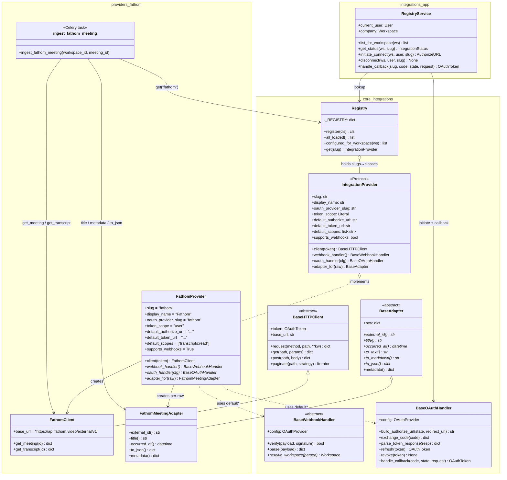
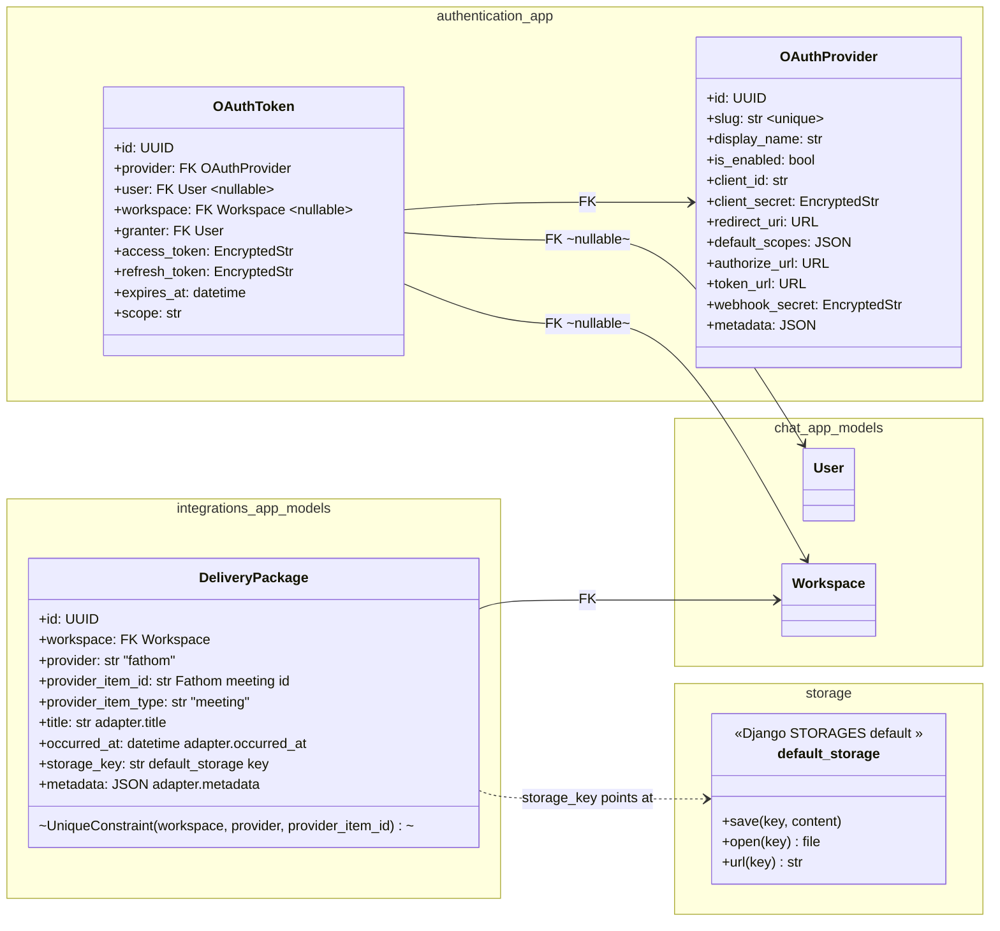
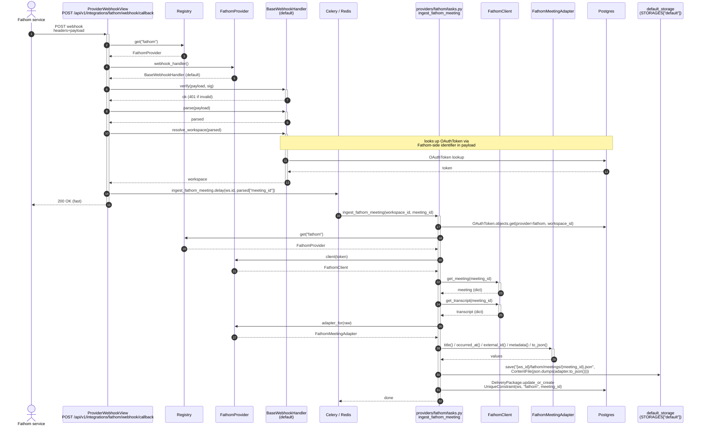
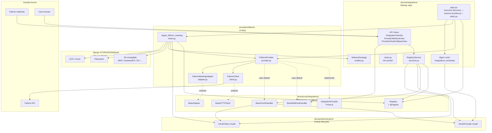

# Fathom integration — diagrams (v1 MVP)

Visualizations of the Fathom integration as designed in [05-integration-architecture.md](../05-integration-architecture.md) and [06-deployment-and-self-hosting.md](../06-deployment-and-self-hosting.md). Use markdown preview (VS Code: <kbd>⌘⇧V</kbd>) to render the Mermaid diagrams.

**v1 MVP scope** (locked):
- 4 files per simple provider (`provider.py`, `client.py`, `adapter.py`, `tasks.py`)
- One model in `integrations` app: `DeliveryPackage` (no `WebhookDelivery`, no `IngestionJob`)
- One service: `RegistryService` (no `IngestionService` — view-direct)
- No `BronzeStorage` facade — task calls `default_storage` directly
- No `TokenBucket` — add when first rate limit bites
- Webhook callback: `/api/v1/integrations/{slug}/webhook/callback`
- OAuth callback: `/api/v1/integrations/{slug}/oauth/callback`
- Per-provider Celery tasks live in `providers/<vendor>/<product>/tasks.py`

---

## 1. Class diagram — framework primitives + Fathom implementation



\* Fathom uses framework defaults for webhook + OAuth; only Provider, Client, Adapter, Tasks are Fathom-specific files (4 total).

---

## 2. Class diagram — data models (one new model)



**Deferred from v1** (revive when needed): `WebhookDelivery`, `IngestionJob`, `BronzeStorage` framework primitive, `WorkspaceStorageConfig`. See [02-data-model.md#open](../02-data-model.md#open).

---

## 3. Sequence — webhook ingestion flow



---

## 4. Sequence — OAuth connect flow

```mermaid
sequenceDiagram
    autonumber
    actor User
    participant Client as Web/API client
    participant View as IntegrationViewSet<br/>POST /api/v1/integrations/fathom/connect
    participant RS as RegistryService
    participant Reg as Registry
    participant FP as FathomProvider
    participant OH as BaseOAuthHandler<br/>(default)
    participant DB as Postgres
    actor Fathom as Fathom OAuth server
    participant CB as ProviderOAuthCallbackView<br/>GET /api/v1/integrations/fathom/oauth/callback

    User->>+Client: click "Connect Fathom"
    Client->>+View: POST /connect<br/>X-Workspace-Id
    View->>RS: initiate_connect(ws, user, "fathom")
    RS->>DB: OAuthProvider.objects.get(slug="fathom")
    alt OAuthProvider.is_enabled = False
        RS-->>View: raise NotConfigured
        View-->>Client: 503 not configured
    else enabled
        RS->>Reg: get("fathom")
        Reg-->>RS: FathomProvider
        RS->>FP: oauth_handler(cfg)
        FP-->>RS: BaseOAuthHandler (default)
        RS->>+OH: build_authorize_url(state, redirect_uri)
        OH-->>-RS: authorize_url<br/>(state encodes user_id, ws_id, slug, redirect_to)
        RS-->>-View: AuthorizeURL
        View-->>-Client: 200 {authorize_url}
        Client->>User: redirect to authorize_url
    end

    User->>+Fathom: authorize app + scopes
    Fathom-->>-User: redirect back with ?code&state

    User->>+CB: GET /api/v1/integrations/fathom/oauth/callback?code&state
    CB->>RS: handle_callback("fathom", code, state, request)
    RS->>Reg: get("fathom")
    Reg-->>RS: FathomProvider
    RS->>FP: oauth_handler(cfg)
    FP-->>RS: BaseOAuthHandler
    RS->>+OH: handle_callback(code, state, request)
    OH->>OH: verify signed state → recover (user, ws)
    OH->>+Fathom: POST token_url<br/>{code, client_id, client_secret}
    Fathom-->>-OH: {access_token, refresh_token, expires_in, scope}
    OH->>OH: parse_token_response(resp)
    OH->>DB: OAuthToken.create<br/>provider=fathom, user=u<br/>access=encrypted, refresh=encrypted
    OH-->>-RS: OAuthToken
    RS-->>CB: success
    CB-->>-User: 302 redirect → /app/integrations/fathom?status=connected
```

---

## 5. Sequence — OAuth disconnect flow

```mermaid
sequenceDiagram
    autonumber
    actor User
    participant Client as Web/API client
    participant View as IntegrationViewSet<br/>POST /api/v1/integrations/fathom/disconnect
    participant RS as RegistryService
    participant Reg as Registry
    participant FP as FathomProvider
    participant OH as BaseOAuthHandler<br/>(default)
    participant DB as Postgres
    actor Fathom as Fathom OAuth server

    User->>+Client: click "Disconnect Fathom"
    Client->>+View: POST /disconnect<br/>X-Workspace-Id
    View->>RS: disconnect(ws, user, "fathom")
    RS->>DB: OAuthToken.objects.get(provider__slug="fathom", user=user)
    alt no token
        RS-->>View: 404 not connected
        View-->>Client: 404
    else
        RS->>Reg: get("fathom")
        Reg-->>RS: FathomProvider
        RS->>FP: oauth_handler(cfg)
        FP-->>RS: BaseOAuthHandler
        RS->>+OH: revoke(token)
        OH->>+Fathom: POST revocation endpoint<br/>(best-effort)
        Fathom-->>-OH: 200 / error (ignored)
        OH-->>-RS: ok
        RS->>DB: token.delete()
        RS-->>-View: ok
        View-->>-Client: 204
    end
```

---

## 6. Component diagram — module wiring (v1)



---

## 7. Endpoint surface (6 endpoints, v1)

| # | Method | Path | Tenant via | Auth | View | Returns |
|---|---|---|---|---|---|---|
| 1 | `GET` | `/api/v1/integrations` | Header | User | `IntegrationViewSet.list` | List of providers + status |
| 2 | `GET` | `/api/v1/integrations/{slug}` | Header | User | `IntegrationViewSet.retrieve` | One provider detail |
| 3 | `POST` | `/api/v1/integrations/{slug}/connect` | Header | User | `IntegrationViewSet.connect` | `{authorize_url}` |
| 4 | `POST` | `/api/v1/integrations/{slug}/disconnect` | Header | User | `IntegrationViewSet.disconnect` | 204 |
| 5 | `POST` | `/api/v1/integrations/{slug}/webhook/callback` | — | Signature | `ProviderWebhookView.post` | 200 (fast) |
| 6 | `GET` | `/api/v1/integrations/{slug}/oauth/callback` | — | State param | `ProviderOAuthCallbackView.get` | 302 redirect |

Endpoints 5 + 6 are non-tenanted and added to `WorkspaceMiddleware.IGNORED_PATHS` via URL-suffix matching (`endswith("/webhook/callback")` and `endswith("/oauth/callback")`).
